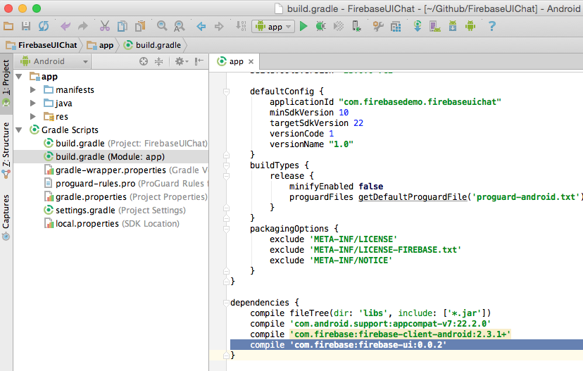

# FirebaseUI-Android

This library provides the simplest way to bind the Firebase Android SDK to your native Android app.
Get started now, be running in minutes.

## Using the library in your Android app

To use the FirebaseUI library in our project, we need to do a few things:

1. Add the library to the list of dependencies of our project
2. Create a class to represent the properties of our objects, as they are stored into the database
3. Create a custom list adapter to map from Firebase to Android

The FirebaseUI library is most prominent in step 3. But first we have to add it to our project.

### Adding the library to your project (gradle.build or module dependencies dialog)

If your Android app already uses Firebase, you have added a dependency to the Firebase SDK to your dependencies.
In this step we'll add the FirebaseUI library as another dependency.

*TODO: add image once the library is available in Maven central*

You can also add the library dependency directly to your app's gradle.build file:

After the project is synchronized, we're ready to start using Firebase functionality in our app.

### Creating a model class

In your app, create a class that represents the data from Firebase that you want to show in the ListView.

So say we have these chat messages in our Firebase database:

We can represent a chat message with this Java class:

    public class ChatMessage {
        String message;
        String name;

        public ChatMessage() {
        }

        public ChatMessage(String name, String message) {
            this.message = message;
            this.name = name;
        }

        public String getMessage() {
            return message;
        }

        public String getName() {
            return name;
        }
    }

A few things to note here:

 * the field have the exact same name as the properties in Firebase. This allows Firebase to automatically map the properties to these fields.
 * there is a default (parameterless constructor) that is necessary for Firebase to be able to create a new instance of this class
 * there is a convenience constructor that takes the member fields, so that we easily create a fully initialized `ChatMessage` in our app
 * the `getMessage` and `getName` methods are so-called getters and follow a JavaBean pattern

A little-known feature of Firebase for Android is that you can pass an instance of this `ChatMessage` class to `setValue()`:

    Firebase ref = new Firebase("https://nanochat.firebaseio.com/");
    ChatMessage msg = new ChatMessage("puf", "Hello FirebaseUI world!");
    ref.push().setValue(msg);

The Firebase Android client will read the values from the `msg` and write them into the properties of the new child in the database.

Conversely, we can read a `ChatMessage` straight from a `DataSnapshot` in our event handlers:

    ref.limitToLast(5).addValueEventListener(new ValueEventListener() {
        @Override
        public void onDataChange(DataSnapshot snapshot) {
            for (DataSnapshot msgSnapshot: snapshot.getChildren()) {
                ChatMessage msg = msgSnapshot.getValue(ChatMessage.class);
                Log.i("Chat", chat.getName()+": "+chat.getMessage());
            }
        }
        @Override
        public void onCancelled(FirebaseError firebaseError) {
            Log.e("Chat", "The read failed: " + firebaseError.getMessage());
        }
    });

In the above snippet we have a query for the last 5 chat messages. Whenever those change (i.e. when an new message is added)
we get the `ChatMessage` objects from the `DataSnapshot` with `getValue(ChatMessage.class)`. The Firebase Android client will
then read the properties that it got from the database and map them to the fields of our `ChatMessage` class.

But when we build our app using FirebaseUI, we often won't need to register our own EventListener. The
`FirebaseListAdapter` takes care of that for us.

### Subclassing the FirebaseListAdapter

#### Look up the ListView

We'll assume you've already added a `ListView` to your layout and have looked it up in the `onCreate` method of your activity:

    @Override
    protected void onCreate(Bundle savedInstanceState) {
        super.onCreate(savedInstanceState);
        setContentView(R.layout.activity_main);

        ListView messagesView = (ListView) findViewById(R.id.messages_list);
    }

#### Set up connection to Firebase

First we'll tell Firebase that we intend to use it in this activity and set up a reference to the database of chat message.

    @Override
    protected void onCreate(Bundle savedInstanceState) {
        super.onCreate(savedInstanceState);
        setContentView(R.layout.activity_main);

        ListView messagesView = (ListView) findViewById(R.id.messages_list);

        Firebase.setAndroidContext(this);
        Firebase ref = new Firebase("https://nanochat.firebaseio.com");
    }

#### Create custom FirebaseListAdapter subclass

Next, we need to create a subclass of the `FirebaseListAdapter` with the correct parameters and implement its `populateView` method:

    @Override
    protected void onCreate(Bundle savedInstanceState) {
        super.onCreate(savedInstanceState);
        setContentView(R.layout.activity_main);

        ListView messagesView = (ListView) findViewById(R.id.messages_list);

        Firebase.setAndroidContext(this);
        Firebase ref = new Firebase("https://nanochat.firebaseio.com");

        mAdapter = new FirebaseListAdapter<ChatMessage>(ChatMessage.class, android.R.layout.two_line_list_item, this, ref) {
            @Override
            protected void populateView(View view, ChatMessage chatMessage) {
                ((TextView)view.findViewById(android.R.id.text1)).setText(chatMessage.getName());
                ((TextView)view.findViewById(android.R.id.text2)).setText(chatMessage.getMessage());

            }
        };
        messagesView.setListAdapter(mAdapter);
    }

In this last snippet we create a subclass of `FirebaseListAdapter`.
We tell is that it is of type `<ChatMessage>`, so that it is a type-safe collection. We also tell it to use
`ChatMessage.class` when reading messages from the database. Next we say that each message will be displayed in
a `android.R.layout.two_line_list_item`, which is a built-in layout in Android that has two `TextView` elements
under each other. Then we say that the adapter belongs to `this` activity and that it needs to monitor the
data location in `ref`.

We also have to override the `populateView()` method, which is abstract in the `FirebaseListAdapter`. The
`FirebaseListAdapter` will call our `populateView` method for each `ChatMessage` it finds in the database.
It passes us the `ChatMessage` and a `View`, which is an instance of the `android.R.layout.two_line_list_item`
we specified in the constructor. So what we do in our subclass is map the fields from `chatMessage` to the
correct `TextView` controls from the `view`. The code is a bit verbose, but hey... that's Java and Android for you.

#### Clean up when the activity is destroyed

Finally, we need to clean up after ourselves. When the activity is destroyed, we need to call `release()`
on the `ListAdapter` so that it can stop listening for changes in the Firebase database.

    @Override
    protected void onDestroy() {
        super.onDestroy();
        mAdapter.cleanup();
    }

#### Sending chat messages

Remember when we showed how to use the `ChatMessage` class in `setValue()`.
We can now use that in our activity to allow sending a message:

    @Override
    protected void onCreate(Bundle savedInstanceState) {
        super.onCreate(savedInstanceState);
        setContentView(R.layout.activity_main);

        ListView messagesView = (ListView) findViewById(R.id.messages_list);

        Firebase.setAndroidContext(this);
        Firebase ref = new Firebase("https://nanochat.firebaseio.com");

        mAdapter = new FirebaseListAdapter<ChatMessage>(ChatMessage.class, android.R.layout.two_line_list_item, this, ref) {
            @Override
            protected void populateView(View view, ChatMessage chatMessage) {
                ((TextView)view.findViewById(android.R.id.text1)).setText(chatMessage.getName());
                ((TextView)view.findViewById(android.R.id.text2)).setText(chatMessage.getMessage());
            }
        };
        setListAdapter(mAdapter);

        final EditText mMessage = (EditText) findViewById(R.id.message_text);
        findViewById(R.id.send_button).setOnClickListener(new View.OnClickListener() {
            @Override
            public void onClick(View v) {
                mRef.push().setValue(new ChatMessage("puf", mMessage.getText().toString()));
                mMessage.setText("");
            }
        });
    }

    @Override
    protected void onDestroy() {
        super.onDestroy();
        mAdapter.cleanup();
    }

Et voila: a minimal, yet fully functional, chat app in about 30 lines of code. Not bad, right?

## Contributor License Agreements

We'd love to accept your sample apps and patches! Before we can take them, we
have to jump a couple of legal hurdles.

Please fill out either the individual or corporate Contributor License Agreement
(CLA).

  * If you are an individual writing original source code and you're sure you
    own the intellectual property, then you'll need to sign an [individual CLA]
    (https://developers.google.com/open-source/cla/individual).
  * If you work for a company that wants to allow you to contribute your work,
    then you'll need to sign a [corporate CLA]
    (https://developers.google.com/open-source/cla/corporate).

Follow either of the two links above to access the appropriate CLA and
instructions for how to sign and return it. Once we receive it, we'll be able to
accept your pull requests.

## Contributing A Patch

1. Submit an issue describing your proposed change to the repo in question.
1. The repo owner will respond to your issue promptly.
1. If your proposed change is accepted, and you haven't already done so, sign a
   Contributor License Agreement (see details above).
1. Fork the desired repo, develop and test your code changes.
1. Ensure that your code adheres to the existing style of the library to which
   you are contributing.
1. Ensure that your code has an appropriate set of unit tests which all pass.
1. Submit a pull request.
