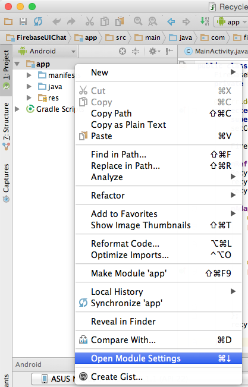
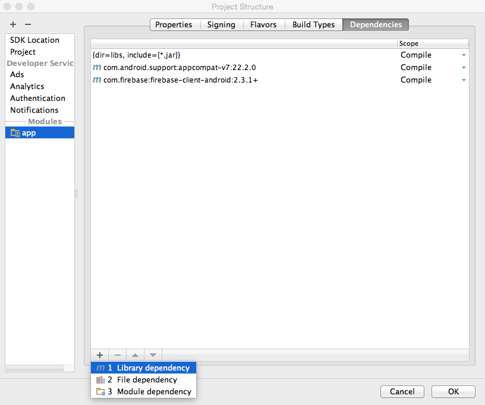
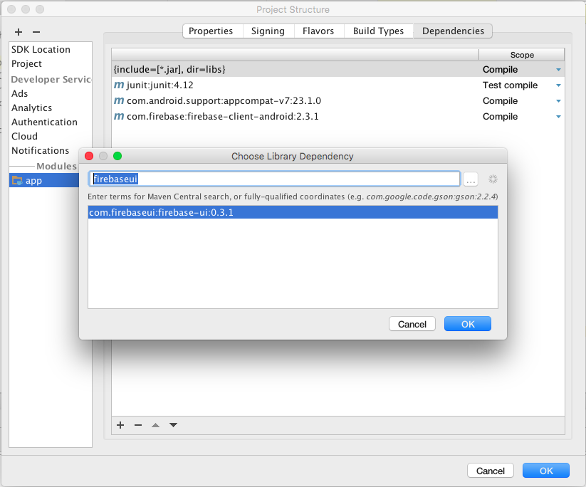
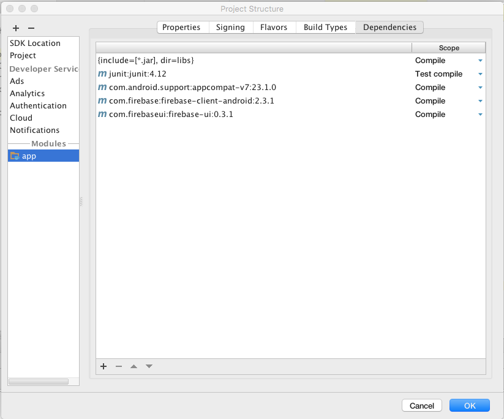
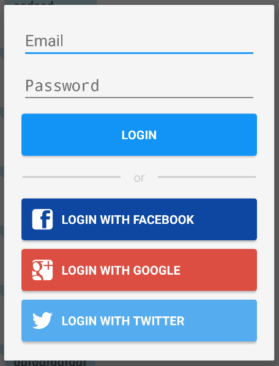
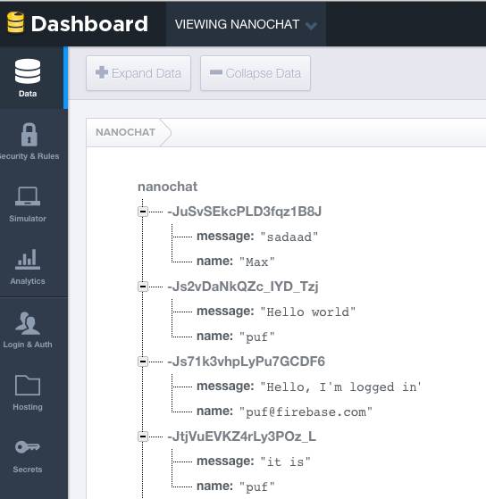

# FirebaseUI for Android — UI Bindings for Firebase

FirebaseUI is an open-source library for Android that allows you to quickly connect common UI elements to the [Firebase](https://www.firebase.com) database for data storage, allowing views to be updated in realtime as they change, providing simple interfaces for common tasks like displaying lists or collections of items, and displaying prompts for user authentication.

A compatible FirebaseUI client is also available for [iOS](https://github.com/firebase/firebaseui-ios).

## Table of Content

1. [Installation](#installation)
2. [Using FirebaseUI for Authentication](#using-firebaseui-for-authentication)
3. [Using FirebaseUI to Populate a ListView](#using-firebaseui-to-populate-a-listview)
4. [Using FirebaseUI to Populate a RecyclerView](#using-firebaseui-to-populate-a-recyclerview)
5. [Contributing](#contributing)

## Installation

If your Android app already uses Firebase, you have added a dependency to the Firebase SDK to your dependencies.
In this step we'll add the FirebaseUI library as another dependency.






You can also add the library dependency directly to your app's gradle.build file:

```
dependencies {
    compile 'com.firebaseui:firebase-ui:0.3.1'
}
```

After the project is synchronized, we're ready to start using Firebase functionality in our app.

## Using FirebaseUI for Authentication

FirebaseUI has a built-in dialog that you can use pop up to allow your users to log in.



To use FirebaseUI to authenticate users we need to do a few things:

1. Add SDK dependencies
2. Add Facebook/Twitter/Google keys to strings.xml
3. Change our AndroidManifest.xml
4. Inherit from FirebaseLoginBaseActivity
5. Enable authentication providers
6. Call showFirebaseLoginDialog();

We'll go into each of these steps below.

### Add SDK dependencies

Since FirebaseUI depends on the SDKs of various providers, we'll need to include those in our dependencies as well.

```
dependencies {
    ...
    compile 'com.facebook.android:facebook-android-sdk:4.6.0'
    compile 'com.google.android.gms:play-services-auth:8.3.0'
    compile 'org.twitter4j:twitter4j-core:4.0.2'
}
```

### Add Facebook/Twitter/Google keys

Open your application's `res/values/strings.xml` file and add the following lines, replacing `[VALUE]` with your key.

Keep in mind, these are all optional. You only have to provide values for the providers you plan to use.

 [`FirebaseLoginBaseActivity.java`](library/src/main/java/com/firebase/ui/auth/core/FirebaseLoginBaseActivity.java).

```xml
<string name="facebook_app_id">[VALUE]</string>
<string name="twitter_app_key">[VALUE]</string>
<string name="twitter_app_secret">[VALUE]</string>
```

If you're using Google authentication, place your `google-services.json` in the app folder.

### Change our AndroidManifest.xml

Open your `manifests/AndroidManifest.xml` file. This will allow Android to recognize the various activities that FirebaseUI exposes.

First though, double check that you've requested the `INTERNET` permission in your `<manifest>` tag.

```xml
<uses-permission android:name="android.permission.INTERNET"></uses-permission>
```

If you're using Twitter authentication, add the following to your `<application>` tag.

```xml
<!-- Twitter Configuration -->
<activity android:name="com.firebase.ui.auth.twitter.TwitterPromptActivity" />
<meta-data
    android:name="com.firebase.ui.TwitterKey"
    android:value="@string/twitter_app_key"/>
<meta-data
    android:name="com.firebase.ui.TwitterSecret"
    android:value="@string/twitter_app_secret"/>
```

If you're using Facebook authentication, add the following to your `<application>` tag.

```xml
<!-- Facebook Configuration -->
<activity
    android:name="com.facebook.FacebookActivity"
    android:configChanges="keyboard|keyboardHidden|screenLayout|screenSize|orientation"
    android:label="@string/app_name"
    android:theme="@android:style/Theme.Translucent.NoTitleBar" />
<meta-data
    android:name="com.facebook.sdk.ApplicationId"
    android:value="@string/facebook_app_id" />
```

### Inherit from FirebaseLoginBaseActivity

Now we get to the juicy bits. Open your `MainActivity` and change your activity to extend `FirebaseLoginBaseActivity`

```java
public class MainActivity extends FirebaseLoginBaseActivity {
    ...
}
```

This activity should implement a few methods so your application can react to changing authentication state.

```java
public class MainActivity extends FirebaseLoginBaseActivity {
    ...
    @Override
    public Firebase getFirebaseRef() {
        // TODO: Return your Firebase ref
    }

    @Override
    public void onFirebaseLoginProviderError(FirebaseLoginError firebaseError) {
        // TODO: Handle an error from the authentication provider
    }

    @Override
    public void onFirebaseLoginUserError(FirebaseLoginError firebaseError) {
        // TODO: Handle an error from the user
    }
}
```

In addition you can override these methods to customize what happens when a user logs in or out:

```
    @Override
    public void onFirebaseLoggedIn(AuthData authData) {
        // TODO: Handle successful login
    }

    @Override
    public void onFirebaseLoggedOut() {
        // TODO: Handle logout
    }

```

If you want to know the current `AuthData` at any point, you can call `getAuth()`. This will return the `AuthData` for the currently authenticated user, or `null` if no user is authenticated.

### Enable Authentication Providers

Now that our activity is set up, we can enable authentication providers. The FirebaseUI login prompt will only display providers you enable here, so don't worry if you don't want to use them all!

```java
public class MainActivity extends FirebaseLoginBaseActivity {
    ...
    @Override
    protected FirebaseLoginConfig onCreateFirebaseConfig() {
        // All providers are optional! Don't enable those which you don't want.
        return new FirebaseLoginConfig.Builder()
                .setPasswordProviderEnabled(true)
                .setGoogleProviderEnabled(true)
                .setTwitterProviderEnabled(true)
                .setFacebookProviderEnabled(true)
                .build();
    }
```

Facebook provider requests just `public_profile` by default, the scope of the permissions can be alerted via `setFacebookPermissions()`

```java
public class MainActivity extends FirebaseLoginBaseActivity {
    ...
    @Override
    protected FirebaseLoginConfig onCreateFirebaseConfig() {
        return new FirebaseLoginConfig.Builder()
                .setFacebookProviderEnabled(true)
                .setFacebookPermissions(Arrays.asList("public_profile", "email"))
                .build();
    }
```

### Call showFirebaseLoginPrompt();

You're now ready to display the login dialog!

Simply call `showFirebaseLoginPrompt()` from within your activity and you'll see the dialog!

For example, if we had a mLoginButton, we could display the dialog when the user clicks the button.
```java
mLoginButton.setOnClickListener(new View.OnClickListener() {
    @Override
    public void onClick(View view) {
        showFirebaseLoginPrompt();
    }
});
```


## Using FirebaseUI to Populate a ListView

To use the FirebaseUI to display Firebase data, we need to do a few things:

1. Create a class to represent the properties of our objects, as they are stored into the database
2. Create a custom list adapter to map from Firebase to Android

### Creating a model class

In your app, create a class that represents the data from Firebase that you want to show in the ListView.

So say we have these chat messages in our Firebase database:



We can represent a chat message with this Java class:

```java
public class ChatMessage {
    String message;
    String name;

    public ChatMessage() {
    }

    public ChatMessage(String name, String message) {
        this.message = message;
        this.name = name;
    }

    public String getMessage() {
        return message;
    }

    public String getName() {
        return name;
    }
}
```
A few things to note here:

 * the field have the exact same name as the properties in Firebase. This allows Firebase to automatically map the properties to these fields.
 * there is a default (parameterless constructor) that is necessary for Firebase to be able to create a new instance of this class
 * there is a convenience constructor that takes the member fields, so that we easily create a fully initialized `ChatMessage` in our app
 * the `getMessage` and `getName` methods are so-called getters and follow a JavaBean pattern

A little-known feature of Firebase for Android is that you can pass an instance of this `ChatMessage` class to `setValue()`:

```java
Firebase ref = new Firebase("https://nanochat.firebaseio.com/");
ChatMessage msg = new ChatMessage("puf", "Hello FirebaseUI world!");
ref.push().setValue(msg);
```
The Firebase Android client will read the values from the `msg` and write them into the properties of the new child in the database.

Conversely, we can read a `ChatMessage` straight from a `DataSnapshot` in our event handlers:

```java
ref.limitToLast(5).addValueEventListener(new ValueEventListener() {
    @Override
    public void onDataChange(DataSnapshot snapshot) {
        for (DataSnapshot msgSnapshot: snapshot.getChildren()) {
            ChatMessage msg = msgSnapshot.getValue(ChatMessage.class);
            Log.i("Chat", chat.getName()+": "+chat.getMessage());
        }
    }
    @Override
    public void onCancelled(FirebaseError firebaseError) {
        Log.e("Chat", "The read failed: " + firebaseError.getMessage());
    }
});
```
In the above snippet we have a query for the last 5 chat messages. Whenever those change (i.e. when an new message is added)
we get the `ChatMessage` objects from the `DataSnapshot` with `getValue(ChatMessage.class)`. The Firebase Android client will
then read the properties that it got from the database and map them to the fields of our `ChatMessage` class.

But when we build our app using FirebaseUI, we often won't need to register our own EventListener. The
`FirebaseListAdapter` takes care of that for us.

### Find the ListView

We'll assume you've already added a `ListView` to your layout and have looked it up in the `onCreate` method of your activity:

```java
@Override
protected void onCreate(Bundle savedInstanceState) {
    super.onCreate(savedInstanceState);
    setContentView(R.layout.activity_main);

    ListView messagesView = (ListView) findViewById(R.id.messages_list);
}
```

### Connect to Firebase

First we'll tell Firebase that we intend to use it in this activity and set up a reference to the database of chat message.

```java
@Override
protected void onCreate(Bundle savedInstanceState) {
    super.onCreate(savedInstanceState);
    setContentView(R.layout.activity_main);

    ListView messagesView = (ListView) findViewById(R.id.messages_list);

    Firebase.setAndroidContext(this);
    Firebase ref = new Firebase("https://nanochat.firebaseio.com");
}
```

### Create custom FirebaseListAdapter subclass

Next, we need to create a subclass of the `FirebaseListAdapter` with the correct parameters and implement its `populateView` method:

```java
@Override
protected void onCreate(Bundle savedInstanceState) {
    super.onCreate(savedInstanceState);
    setContentView(R.layout.activity_main);

    ListView messagesView = (ListView) findViewById(R.id.messages_list);

    Firebase.setAndroidContext(this);
    Firebase ref = new Firebase("https://nanochat.firebaseio.com");

    mAdapter = new FirebaseListAdapter<ChatMessage>(this, ChatMessage.class, android.R.layout.two_line_list_item, ref) {
        @Override
        protected void populateView(View view, ChatMessage chatMessage, int position) {
            ((TextView)view.findViewById(android.R.id.text1)).setText(chatMessage.getName());
            ((TextView)view.findViewById(android.R.id.text2)).setText(chatMessage.getMessage());

        }
    };
    messagesView.setAdapter(mAdapter);
}
```

In this last snippet we create a subclass of `FirebaseListAdapter`.
We tell is that it is of type `<ChatMessage>`, so that it is a type-safe collection. We also tell it to use
`ChatMessage.class` when reading messages from the database. Next we say that each message will be displayed in
a `android.R.layout.two_line_list_item`, which is a built-in layout in Android that has two `TextView` elements
under each other. Then we say that the adapter belongs to `this` activity and that it needs to monitor the
data location in `ref`.

We also have to override the `populateView()` method, which is abstract in the `FirebaseListAdapter`. The
`FirebaseListAdapter` will call our `populateView` method for each `ChatMessage` it finds in the database.
It passes us the `ChatMessage` and a `View`, which is an instance of the `android.R.layout.two_line_list_item`
we specified in the constructor. So what we do in our subclass is map the fields from `chatMessage` to the
correct `TextView` controls from the `view`. The code is a bit verbose, but hey... that's Java and Android for you.

### Clean up When the Activity is Destroyed

Finally, we need to clean up after ourselves. When the activity is destroyed, we need to call `release()`
on the `ListAdapter` so that it can stop listening for changes in the Firebase database.

```java
@Override
protected void onDestroy() {
    super.onDestroy();
    mAdapter.cleanup();
}
```

### Send Chat Messages

Remember when we showed how to use the `ChatMessage` class in `setValue()`.
We can now use that in our activity to allow sending a message:

```java
@Override
protected void onCreate(Bundle savedInstanceState) {
    super.onCreate(savedInstanceState);
    setContentView(R.layout.activity_main);

    ListView messagesView = (ListView) findViewById(R.id.messages_list);

    Firebase.setAndroidContext(this);
    Firebase ref = new Firebase("https://nanochat.firebaseio.com");

    mAdapter = new FirebaseListAdapter<ChatMessage>(this, ChatMessage.class, android.R.layout.two_line_list_item, ref) {
        @Override
        protected void populateView(View view, ChatMessage chatMessage, int position) {
            ((TextView)view.findViewById(android.R.id.text1)).setText(chatMessage.getName());
            ((TextView)view.findViewById(android.R.id.text2)).setText(chatMessage.getMessage());
        }
    };
    messagesView.setAdapter(mAdapter);

    final EditText mMessage = (EditText) findViewById(R.id.message_text);
    findViewById(R.id.send_button).setOnClickListener(new View.OnClickListener() {
        @Override
        public void onClick(View v) {
            mRef.push().setValue(new ChatMessage("puf", mMessage.getText().toString()));
            mMessage.setText("");
        }
    });
}

@Override
protected void onDestroy() {
    super.onDestroy();
    mAdapter.cleanup();
}
```

You're done! You now have a minimal, yet fully functional, chat app in about 30 lines of code. Not bad, right?

## Using FirebaseUI to Populate a RecyclerView

RecyclerView is the new preferred way to handle potentially long lists of items. Since Firebase collections
can contain many items, there is an `FirebaseRecyclerAdapter` too. Here's how you use it:

1. Create a custom ViewHolder class
2. Create a custom subclass FirebaseListAdapter

The rest of the steps is the same as for the `FirebaseListAdapter` above, so be sure to read that first.

### Create a custom ViewHolder

A ViewHolder is similar to container of a ViewGroup that allows simple lookup of the sub-views of the group.
If we use the same layout as before (`android.R.layout.two_line_list_item`), there are two `TextView`s in there.
We can wrap that in a ViewHolder with:

```java
public static class ChatMessageViewHolder extends RecyclerView.ViewHolder {
    TextView messageText;
    TextView nameText;

    public ChatMessageViewHolder(View itemView) {
        super(itemView);
        nameText = (TextView)itemView.findViewById(android.R.id.text1);
        messageText = (TextView) itemView.findViewById(android.R.id.text2);
    }
}
```

There's nothing magical going on here; we're just mapping numeric IDs and casts into a nice, type-safe contract.

### Create a custom FirebaseRecyclerAdapter

Just like we did for `FirebaseListAdapter`, we'll create an anonymous subclass for our ChatMessages, but this time we'll use `FirebaseRecyclerAdapter`:

```java
RecyclerView recycler = (RecyclerView) findViewById(R.id.messages_recycler);
recycler.setHasFixedSize(true);
recycler.setLayoutManager(new LinearLayoutManager(this));

mAdapter = new FirebaseRecyclerAdapter<ChatMessage, ChatMessageViewHolder>(ChatMessage.class, android.R.layout.two_line_list_item, ChatMessageViewHolder.class, mRef) {
    @Override
    public void populateViewHolder(ChatMessageViewHolder chatMessageViewHolder, ChatMessage chatMessage, int position) {
        chatMessageViewHolder.nameText.setText(chatMessage.getName());
        chatMessageViewHolder.messageText.setText(chatMessage.getMessage());
    }
};
recycler.setAdapter(mAdapter);
```

Like before, we get a custom RecyclerView populated with data from Firebase by setting the properties to the correct fields.

## Contributing

### Installing locally

We are still working on deploying FirebaseUI to Maven Central. In the meantime, you can download the
latest release from the Releases tab on the Github repo and install it into your local Maven repository
with:

    mvn install:install-file -Dfile=/path/to/library-debug.aar -DgroupId=com.firebaseui -DartifactId=firebase-ui -Dversion=0.1.0 -Dpackaging=aar

###  Deployment
To get the build server ready to build FirebaseUI-Android

* Install a JDK (if it's not installed yet):
* `sudo apt-get install default-jdk`
* Run `./gradlew` (which will install gradle if it's not yet installed)
* Install the Android SDK tool for Linux
* `wget http://dl.google.com/android/android-sdk_r22.0.5-linux.tgz`
* `tar -xvzf android-sdk_r22.0.5-linux.tgz`
* Add the android SDK path to `.bashrc`:
* `export ANDROID_HOME=~/android-sdk-linux/`
* `export PATH=$PATH:~/android-sdk-linux/tools`
* Install the Android SDK needed for FirebaseUI
* `android update sdk -u`
* `android list sdk --all`
* `android update sdk -u --all --filter platform-tools,android-22,extra-android-support`
* `android update sdk --no-ui --filter extra`
* The Android aapt tool is 32-bit only. If the machine is 64-bit, we'll need to install some compatibility libraries:
* `uname -a`
* > Linux puf 3.16.0-45-generic #60~14.04.1-Ubuntu SMP Fri Jul 24 21:16:23 UTC 2015 x86_64 x86_64 x86_64 GNU/Linux
* `sudo apt-get install lib32stdc++6`
* `sudo apt-get install lib32z1`
* Run `./gradlew` to ensure it loads/parses the project
* Now run a build `./gradlew build`
* Set up for signing and uploading the aar
* `vi ~/.gradle/gradle.properties`
    signing.keyId=94B86DB8
    signing.password=PrivateKeyPassword
    signing.secretKeyRingFile=/path/to/gpg/secring.gpg

    sonatypeRepo=https://oss.sonatype.org/service/local/staging/deploy/maven2/
    sonatypeUsername=YourSonatypeJiraUsername
    sonatypePassword=YourSonatypeJiraPassword

## to build a release

* build the project in Android Studio or with Gradle
* this generates the main binary: `library/build/outputs/aar/library-debug.aar`
* open the Gradle projects tab, by clicking the tiny gradle tab on the right (or View > Tool Windows > Gradle)
* select  :library > Tasks > other > bundleReleaseJavadoc
* this generates the javadoc: `library/build/outputs/library-javadoc.jar`


## to tag a release on Github

* ensure that all your changes are on master and that your local build is on master
* ensure that the correct version number is in both `library/build.gradle` and `library/pom.xml`


## to deploy a release to Maven Central

* log onto the build box
* checkout and update the master branch
* `./release.sh` to build the library and update maven
* close/release the repository from sonatype

## Contributor License Agreements

We'd love to accept your sample apps and patches! Before we can take them, we
have to jump a couple of legal hurdles.

Please fill out either the individual or corporate Contributor License Agreement
(CLA).

  * If you are an individual writing original source code and you're sure you
    own the intellectual property, then you'll need to sign an [individual CLA]
    (https://developers.google.com/open-source/cla/individual).
  * If you work for a company that wants to allow you to contribute your work,
    then you'll need to sign a [corporate CLA]
    (https://developers.google.com/open-source/cla/corporate).

Follow either of the two links above to access the appropriate CLA and
instructions for how to sign and return it. Once we receive it, we'll be able to
accept your pull requests.

## Contribution Process

1. Submit an issue describing your proposed change to the repo in question.
1. The repo owner will respond to your issue promptly.
1. If your proposed change is accepted, and you haven't already done so, sign a
   Contributor License Agreement (see details above).
1. Fork the desired repo, develop and test your code changes.
1. Ensure that your code adheres to the existing style of the library to which
   you are contributing.
1. Ensure that your code has an appropriate set of unit tests which all pass.
1. Submit a pull request and cc @puf or @mcdonamp
