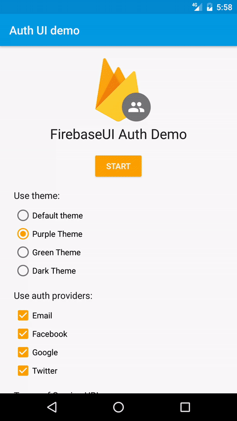
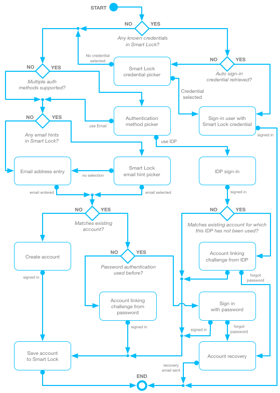

# FirebaseUI for Auth

FirebaseUI is an open-source library that offers simple,
customizable UI bindings on top of the core
[Firebase](https://firebase.google.com) SDKs. It aims to eliminate boilerplate
code and promote best practices (both user experience and security) for
authentication.

A simple API is provided for drop-in user authentication which handles the flow
of signing in users with email addresses and passwords, phone numbers, and federated identity
providers such as Google Sign-In, and Facebook Login. It is built on top of
[Firebase Auth](https://firebase.google.com/docs/auth).

The best practices embodied in FirebaseUI aim to maximize sign-in
and sign-up conversion for your app. It integrates with
[Smart Lock for Passwords](https://developers.google.com/identity/smartlock-passwords/android/)
to store and retrieve credentials, enabling automatic and single-tap sign-in to
your app for returning users. It also handles tricky use cases like
account recovery and account linking that are security sensitive and
difficult to implement correctly using the base APIs provided by Firebase Auth.

FirebaseUI auth can be easily customized to fit with the rest of your app's
visual style. As it is open source, you are also free to modify it to exactly
fit your preferred user experience.

Equivalent FirebaseUI auth libraries are also available for
[iOS](https://github.com/firebase/firebaseui-ios/)
and [Web](https://github.com/firebase/firebaseui-web/).

## Table of contents

1. [Demo](#demo)
1. [Configuration](#configuration)
   1. [Provider config](#identity-provider-configuration)
1. [Usage instructions](#using-firebaseui-for-authentication)
   1. [AuthUI sign-in](#authui-sign-in)
   1. [Handling responses](#handling-the-sign-in-response)
   1. [Silent sign-in](#silent-sign-in)
   1. [Sign out](#sign-out)
   1. [Account deletion](#deleting-accounts)
   1. [Upgrading Anonymous Users](#upgrading-anonymous-users)
   1. [Auth flow chart](#authentication-flow-chart)
1. [Customization](#ui-customization)
   1. [Required setup](#required-setup)
   1. [Themes](#themes)
   1. [Strings](#strings)
1. [OAuth scopes](#oauth-scope-customization)
   1. [Google](#google-1)
   1. [Facebook](#facebook-1)
   1. [Twitter](#twitter-1)
   1. [GitHub](#github-1)

## Demo



## Configuration

As a pre-requisite, ensure your application is configured for use with
Firebase: see the
[Firebase documentation](https://firebase.google.com/docs/android/setup).
Then, add the FirebaseUI auth library dependency. If your project uses
Gradle, add the dependency:

```groovy
dependencies {
    // ...
    implementation 'com.firebaseui:firebase-ui-auth:4.2.1'

    // Required only if GitHub OAuth support is required
    implementation 'com.firebaseui:firebase-ui-auth-github:4.2.1'

    // Required only if Facebook login support is required
    // Find the latest Facebook SDK releases here: https://goo.gl/Ce5L94
    implementation 'com.facebook.android:facebook-login:4.x'

    // Required only if Twitter login support is required
    // Find the latest Twitter SDK releases here: https://goo.gl/E5wZvQ
    implementation("com.twitter.sdk.android:twitter-core:3.x@aar") { transitive = true }
}
```

As of version `2.1.0` FirebaseUI includes translations for all string resources. In order to
ensure that you only get the translations relevant to your application, we recommend changing the
`resConfigs` of your application module:

```groovy
android {
    // ...

    defaultConfig {
       // ...
       resConfigs "en" // And any other languages you support
    }
}
```

See the [Android documentation](https://developer.android.com/studio/build/shrink-code.html#unused-alt-resources)
for more information.

### Identity provider configuration

In order to use either Google, Facebook or Twitter accounts with your app, ensure that
these authentication methods are first configured in the Firebase console.

#### Google

FirebaseUI client-side configuration for Google sign-in is then provided
automatically by the
[google-services gradle plugin](https://developers.google.com/android/guides/google-services-plugin).

#### Facebook

If support for Facebook Login is also required, define the
resource string `facebook_application_id` to match the application ID in
the [Facebook developer dashboard](https://developers.facebook.com):

```xml
<resources>
    <!-- ... -->
    <string name="facebook_application_id" translatable="false">APP_ID</string>
    <!-- Facebook Application ID, prefixed by 'fb'. Enables Chrome Custom tabs. -->
    <string name="facebook_login_protocol_scheme" translatable="false">fbAPP_ID</string>
</resources>
```

#### Twitter

If support for Twitter Sign-in is also required, define the resource strings
`twitter_consumer_key` and `twitter_consumer_secret` to match the values of your
Twitter app as reported by the [Twitter application manager](https://apps.twitter.com/).

```xml
<resources>
  <string name="twitter_consumer_key" translatable="false">YOUR_CONSUMER_KEY</string>
  <string name="twitter_consumer_secret" translatable="false">YOUR_CONSUMER_SECRET</string>
</resources>
```

In addition, you must enable the "Request email addresses from users" permission
in the "Permissions" tab of your Twitter app.

In order to resolve the Twitter SDK, add the following repository to your `build.gradle`:

```groovy
allprojects {
    repositories {
        // ...
        maven { url 'https://maven.fabric.io/public' }
    }
}
```

#### GitHub

WARNING: GitHub OAuth is not for the faint of heart. Getting it setup correctly is an invested
process and may take a half-hour or two. Ready? Let's begin.

##### Wait, but _why_?

GitHub requires that override redirect URIs only extend the base URI configured in the dashboard for
[security reasons](https://tools.ietf.org/html/rfc6749#section-10.6). What does this mean? For
GitHub auth to work on the web, the full `https://project-id.firebaseapp.com/__/auth/handler`
redirect URI must be specified, thus preventing us Android devs from using a custom scheme (since we
can only extend the base URI with extra path elements).

As a side note, if you don't care about Web or iOS support, you can
simply override our `GitHubLoginActivity`'s intent filters with your custom scheme to skip all these
steps... However, this will make adding support for Web or iOS difficult should you decided to do so
in the future—hence us not officially support this method.

##### Adding secrets

Hop over to your [GitHub app](https://github.com/settings/developers) and grab its client ID and
Secret to put them in your resources:

```xml
<resources>
    <string name="github_client_id" translatable="false">YOUR_CLIENT_ID</string>
    <string name="github_client_secret" translatable="false">YOUR_CLIENT_SECRET</string>
</resources>
```

##### Adding your Firebase web host

Next, find your project id in the Firebase Console's project settings and add it to your resources
in the form `project-id.firebaseapp.com`:

```xml
<resources>
    <string name="firebase_web_host" translatable="false">project-id.firebaseapp.com</string>
</resources>
```

##### Getting a SHA-256 hash of your keystore

[Run the `keytool` utility](https://developers.google.com/android/guides/client-auth) found in your
JDK's installation folder to get a SHA-256 hash of your release keystore. The command should look
something like this (but for your release keystore):

```sh
keytool -list -v \
    -keystore ~/.android/debug.keystore \
    -alias androiddebugkey \
    -storepass android \
    -keypass android
```

Protip: you might as well also grab the release SHA-1 hash and the debug hashes to add them to the
Firebase Console since they're useful in other contexts. Also, adding debug hashes will let you test
all this without having to use a release build.

##### Deploying a Firebase Hosting solution

If you're already using Firebase Hosting, give yourself a pat on the back and move on. Otherwise,
read on! Go through [this tutorial](https://firebase.google.com/docs/hosting/quickstart) and make
sure to say no when asked to
[redirect](https://firebase.google.com/docs/hosting/url-redirects-rewrites) everything to a single
page. If you're already doing that, exclude `.well-known/assetlinks.json`.

##### Adding asset links

So close, you're almost there! Follow step 1 of
[this tutorial](https://developers.google.com/digital-asset-links/v1/getting-started#quick-usage-example)
with your own package name and SHA-256 hash gathered earlier. Now add the resulting JSON to
`.well-known/assetlinks.json` on your Firebase Hosting website and re-deploy it. Your JSON should
look something like this:

```js
[{
  "relation": ["delegate_permission/common.handle_all_urls"],
  "target" : {
    "namespace": "android_app",
    "package_name": "com.your.package.name",
    "sha256_cert_fingerprints": ["your_sha_256_fingerprint"]
  }
}]
```

##### Putting it all together

You should now have:
- String resources with your secrets and Firebase web host
- SHA hashes in the Firebase Console
- A Firebase Hosting website with asset links

Congrats, you did it! All that's left to do is [kick off the sign-in flow](#authui-sign-in).

##### Help, I'm stuck!

In all likelihood, your [asset links](#adding-asset-links) aren't configured correctly. Make sure
that `https://project-id.firebaseapp.com/.well-known/assetlinks.json` resolves without redirects. If
all else fails, FUI team members will help you out on StackOverflow with the `FirebaseUI` tag.

## Using FirebaseUI for authentication

Before invoking the FirebaseUI authentication flow, your app should check
whether a
[user is already signed in](https://firebase.google.com/docs/auth/android/manage-users#get_the_currently_signed-in_user)
from a previous session:

```java
FirebaseAuth auth = FirebaseAuth.getInstance();
if (auth.getCurrentUser() != null) {
    // already signed in
} else {
    // not signed in
}
```

The entry point to the authentication flow is the
`com.firebase.ui.auth.AuthUI` class.
If your application uses the default `FirebaseApp` instance, an AuthUI
instance can be retrieved simply by calling `AuthUI.getInstance()`.
If an alternative app instance is required, call
`AuthUI.getInstance(app)` instead, passing the appropriate `FirebaseApp`
instance.

### AuthUI sign-in

If a user is not currently signed in, as can be determined by checking
`auth.getCurrentUser() != null` (where `auth` is the `FirebaseAuth` instance
associated with your `FirebaseApp`), then the sign-in process can be started by
creating a sign-in intent using `AuthUI.SignInIntentBuilder`. A builder instance
can be retrieved by calling `createSignInIntentBuilder()` on the retrieved
AuthUI instance.

The builder provides the following customization options for the authentication flow:

* The set of authentication providers can be specified.
* The terms of service URL for your app can be specified, which is included as
  a link in the small-print of the account creation step for new users. If no
  terms of service URL is provided, the associated small-print is omitted.
* A custom theme can be specified for the flow, which is applied to all the
  activities in the flow for consistent colors and typography.

#### Sign-in examples

If no customization is required, and only email authentication is required, the sign-in flow
can be started as follows:

```java
// Choose an arbitrary request code value
private static final int RC_SIGN_IN = 123;

// ...

startActivityForResult(
    // Get an instance of AuthUI based on the default app
    AuthUI.getInstance().createSignInIntentBuilder().build(),
    RC_SIGN_IN);
```

To kick off the FirebaseUI sign in flow, call startActivityForResult(...) on the sign in Intent you built.
The second parameter (RC_SIGN_IN) is a request code you define to identify the request when the result
is returned to your app in onActivityResult(...). See the [response codes](#response-codes) section below for more
details on receiving the results of the sign in flow.

##### Adding providers

You can enable sign-in providers like Google Sign-In or Facebook Log In by calling the
`setAvailableProviders` method:

```java
startActivityForResult(
        AuthUI.getInstance()
                .createSignInIntentBuilder()
                .setAvailableProviders(Arrays.asList(
                        new AuthUI.IdpConfig.GoogleBuilder().build(),
                        new AuthUI.IdpConfig.FacebookBuilder().build(),
                        new AuthUI.IdpConfig.TwitterBuilder().build(),
                        new AuthUI.IdpConfig.GitHubBuilder().build(),
                        new AuthUI.IdpConfig.EmailBuilder().build(),
                        new AuthUI.IdpConfig.PhoneBuilder().build(),
                        new AuthUI.IdpConfig.AnonymousBuilder().build()))
                .build(),
        RC_SIGN_IN);
```

##### Adding a ToS and privacy policy

A terms of service URL and privacy policy URL are generally required:

```java
startActivityForResult(
    AuthUI.getInstance()
        .createSignInIntentBuilder()
        .setAvailableProviders(...)
        .setTosAndPrivacyPolicyUrls("https://superapp.example.com/terms-of-service.html",
                                    "https://superapp.example.com/privacy-policy.html")
        .build(),
    RC_SIGN_IN);
```

##### Smart Lock

By default, FirebaseUI uses [Smart Lock for Passwords](https://developers.google.com/identity/smartlock-passwords/android/)
to store the user's credentials and automatically sign users into your app on subsequent attempts.
Using Smart Lock is recommended to provide the best user experience, but in some cases you may want
to disable Smart Lock for testing or development. To disable Smart Lock, you can use the
`setIsSmartLockEnabled` method when building your sign-in Intent:

```java
startActivityForResult(
    AuthUI.getInstance()
        .createSignInIntentBuilder()
        .setIsSmartLockEnabled(false)
        .build(),
    RC_SIGN_IN);
```

###### Smart Lock hints

If you'd like to keep Smart Lock's "hints" but disable the saving/retrieving of credentials, then
you can use the two-argument version of `setIsSmartLockEnabled`:

```java
startActivityForResult(
    AuthUI.getInstance()
        .createSignInIntentBuilder()
        .setIsSmartLockEnabled(false, true)
        .build(),
    RC_SIGN_IN);
```

###### Smart Lock in dev builds

It is often desirable to disable Smart Lock in development but enable it in production. To achieve
this, you can use the `BuildConfig.DEBUG` flag to control Smart Lock:

```java
startActivityForResult(
    AuthUI.getInstance()
        .createSignInIntentBuilder()
        .setIsSmartLockEnabled(!BuildConfig.DEBUG /* credentials */, true /* hints */)
        .build(),
    RC_SIGN_IN);
```

##### Phone number authentication customization

###### Setting a default phone number
When using the phone verification provider and the number is known in advance, it is possible to
provide a default phone number (in international format) that will be used to prepopulate the
country code and phone number input fields. The user is still able to edit the number if desired.

```java
IdpConfig phoneConfigWithDefaultNumber = new IdpConfig.PhoneBuilder()
        .setDefaultNumber("+123456789")
        .build();
```

Alternatively, you can set the default country (alpha-2 format) to be shown in the country selector.

```java
IdpConfig phoneConfigWithDefaultNumber = new IdpConfig.PhoneBuilder()
        .setDefaultCountryIso("ca")
        .build();
```

It is also possible to set a default country code along with a national number if a specific country
is your app's target audience. This will take precedence over the full default phone number if both
are provided.

```java
IdpConfig phoneConfigWithDefaultNumber = new IdpConfig.PhoneBuilder()
        .setDefaultNumber("ca", "23456789")
        .build();
```

###### Limiting the list of available countries in the country selector

You can limit the countries shown in the country selector list. By default, all countries are shown.

You can provide a list of countries to whitelist or blacklist. You can populate these lists with
ISO (alpha-2) and E164 formatted country codes.

```java
List<String> whitelistedCountries = new ArrayList<String>();
whitelistedCountries.add("+1");
whitelistedCountries.add("gr");

IdpConfig phoneConfigWithWhitelistedCountries = new IdpConfig.PhoneBuilder()
        .setWhitelistedCountries(whitelistedCountries)
        .build();
```
All countries with the country code +1 will be present in the selector as well as Greece ('gr').

You may want to exclude a few countries from the list and avoid creating a whitelist with
many countries. You can instead provide a list of countries to blacklist. By doing so, all countries
excluding the ones you provide will be in the selector.

```java
List<String> blacklistedCountries = new ArrayList<String>();
blacklistedCountries.add("+1");
blacklistedCountries.add("gr");

IdpConfig phoneConfigWithBlacklistedCountries = new IdpConfig.PhoneBuilder()
        .setBlacklistedCountries(blacklistedCountries)
        .build();
```

The country code selector will exclude all countries with a country code of +1 and Greece ('gr').

Note: You can't provide both a list of countries to whitelist and blacklist. If you do, a runtime
exception will be thrown.

This change is purely UI based. We do not restrict users from signing in with their phone number.
They will simply be unable to choose their country in the selector, but there may be another country
sharing the same country code (e.g. US and CA are +1).


#####

### Handling the sign-in response

#### Response codes

The authentication flow provides several response codes of which the most common are as follows:
`Activity.RESULT_OK` if a user is signed in, `Activity.RESULT_CANCELED` if the user manually canceled the sign in,
`ErrorCodes.NO_NETWORK` if sign in failed due to a lack of network connectivity,
and `ErrorCodes.UNKNOWN_ERROR` for all other errors.
Typically, the only recourse for most apps if sign in fails is to ask
the user to sign in again later, or proceed with anonymous sign-in if supported.

```java
protected void onActivityResult(int requestCode, int resultCode, Intent data) {
    super.onActivityResult(requestCode, resultCode, data);
    // RC_SIGN_IN is the request code you passed into startActivityForResult(...) when starting the sign in flow.
    if (requestCode == RC_SIGN_IN) {
        IdpResponse response = IdpResponse.fromResultIntent(data);

        // Successfully signed in
        if (resultCode == RESULT_OK) {
            startActivity(SignedInActivity.createIntent(this, response));
            finish();
        } else {
            // Sign in failed
            if (response == null) {
                // User pressed back button
                showSnackbar(R.string.sign_in_cancelled);
                return;
            }

            if (response.getError().getErrorCode() == ErrorCodes.NO_NETWORK) {
                showSnackbar(R.string.no_internet_connection);
                return;
            }

            showSnackbar(R.string.unknown_error);
            Log.e(TAG, "Sign-in error: ", response.getError());
        }
    }
}
```

Alternatively, you can register a listener for authentication state changes;
see the Firebase Auth documentation to
[get the currently signed-in user](https://firebase.google.com/docs/auth/android/manage-users#get_the_currently_signed-in_user)
and [register an AuthStateListener](https://firebase.google.com/docs/reference/android/com/google/firebase/auth/FirebaseAuth.html#addAuthStateListener(com.google.firebase.auth.FirebaseAuth.AuthStateListener)).

Note: if you choose to use an `AuthStateListener`, make sure to unregister it before launching
the FirebaseUI flow and re-register it after the flow returns. FirebaseUI performs auth operations
internally which may trigger the listener before the flow is complete.

#### ID tokens

To retrieve the ID token that the IDP returned, you can extract an `IdpResponse` from the result
Intent.

```java
protected void onActivityResult(int requestCode, int resultCode, Intent data) {
    super.onActivityResult(requestCode, resultCode, data);
    if (resultCode == RESULT_OK) {
        IdpResponse idpResponse = IdpResponse.fromResultIntent(data);
        startActivity(new Intent(this, WelcomeBackActivity.class)
                .putExtra("my_token", idpResponse.getIdpToken()));
    }
}
```

Twitter also returns an AuthToken Secret which can be accessed with `idpResponse.getIdpSecret()`.

#### User metadata

While `IdpResponse` provides user information about a specific sign-in instance, it is usually
preferable to find the user name, email, and other metadata directly from the currently signed-in
`FirebaseUser` instance (`auth.getCurrentUser()`). For example, you could determine if the user
who just signed in is an existing or new one by comparing the user's creation and last sign-in time:

```java
FirebaseUserMetadata metadata = auth.getCurrentUser().getMetadata();
if (metadata.getCreationTimestamp() == metadata.getLastSignInTimestamp()) {
    // The user is new, show them a fancy intro screen!
} else {
    // This is an existing user, show them a welcome back screen.
}
```

### Silent sign-in

If a user is not currently signed in, then a silent sign-in process can be started first before
displaying any UI to provide a seamless experience. Silent sign-in uses saved Smart Lock credentials
and returns a successful `Task` only if the user has been fully signed in with Firebase.

Here's an example of how you could use silent sign-in paired with Firebase anonymous sign-in to get
your users up and running as fast as possible:

```java
List<IdpConfig> providers = getSelectedProviders();
AuthUI.getInstance().silentSignIn(this, providers)
        .continueWithTask(this, new Continuation<AuthResult, Task<AuthResult>>() {
    @Override
    public Task<AuthResult> then(@NonNull Task<AuthResult> task) {
        if (task.isSuccessful()) {
            return task;
        } else {
            // Ignore any exceptions since we don't care about credential fetch errors.
            return FirebaseAuth.getInstance().signInAnonymously();
        }
    }
}).addOnCompleteListener(this, new OnCompleteListener<AuthResult>() {
    @Override
    public void onComplete(@NonNull Task<AuthResult> task) {
        if (task.isSuccessful()) {
            // Signed in! Start loading data
        } else {
            // Uh oh, show error message
        }
    }
});
```

### Sign out

With the integrations provided by AuthUI, signing out a user is a multi-stage process:

1. The user must be signed out of the FirebaseAuth instance.
1. Smart Lock for Passwords must be instructed to disable automatic sign-in, in
   order to prevent an automatic sign-in loop that prevents the user from
   switching accounts.
1. If the current user signed in using either Google or Facebook, the user must
   also be signed out using the associated API for that authentication method.
   This typically ensures that the user will not be automatically signed-in
   using the current account when using that authentication method again from
   the authentication method picker, which would also prevent the user from
   switching between accounts on the same provider.

In order to make this process easier, AuthUI provides a simple `signOut` method
to encapsulate this behavior. The method returns a `Task` which is marked
completed once all necessary sign-out operations are completed:

```java
public void onClick(View v) {
if (v.getId() == R.id.sign_out) {
    AuthUI.getInstance()
        .signOut(this)
        .addOnCompleteListener(new OnCompleteListener<Void>() {
            public void onComplete(@NonNull Task<Void> task) {
                // user is now signed out
                startActivity(new Intent(MyActivity.this, SignInActivity.class));
                finish();
            }
        });
    }
}
```

### Deleting accounts

With the integrations provided by FirebaseUI Auth, deleting a user is a multi-stage process:

1. The user must be deleted from Firebase Auth.
1. Smart Lock for Passwords must be told to delete any existing Credentials for the user, so
   that they are not automatically prompted to sign in with a saved credential in the future.

This process is encapsulated by the `AuthUI.delete()` method, which returns a `Task` representing
the entire operation:

```java
AuthUI.getInstance()
        .delete(this)
        .addOnCompleteListener(new OnCompleteListener<Void>() {
            @Override
            public void onComplete(@NonNull Task<Void> task) {
                if (task.isSuccessful()) {
                    // Deletion succeeded
                } else {
                    // Deletion failed
                }
            }
        });
```

### Upgrading anonymous users

#### Enabling anonymous user upgrade

When an anonymous user signs in or signs up with a permanent account, you want
to be sure that the user can continue with what they were doing before signing up.
For example, an anonymous user might have items in their shopping cart.
At check-out, you prompt the user to sign in or sign up. After the user is
signed in, the user's shopping cart should contain any items the user added
while signed in anonymously.

To support this behavior, FirebaseUI makes it easy to "upgrade" an anonymous
account to a permanent account. To do so, simply call `enableAnonymousUsersAutoUpgrade()`
when you configure the sign-in UI (this option is disabled by default).

For example:
```java
startActivityForResult(
    AuthUI.getInstance()
        .createSignInIntentBuilder()
        .enableAnonymousUsersAutoUpgrade()
        ...
        .build(),
    RC_SIGN_IN);
```

With this enabled, FirebaseUI will link the credential on sign-in with the anonymous account
using Firebase Auth's `linkWithCredential` method:
```java
FirebaseAuth.getInstance().getCurrentUser().linkWithCredential(permanentCredential);
```

#### Handling anonymous user upgrade merge conflicts

There is an issue when an anonymous user tries to upgrade to an existing Firebase user.

For example, a user may have previously signed up with a Google credential on a different device.
If they are signed in anonymously and they attempt to upgrade with the existing Google account,
a `FirebaseAuthUserCollisionException` will be thrown by Firebase Auth as an existing user
cannot be linked to another existing user. No two users can share the same credential. In this case,
we need to merge the data from both users before we can upgrade the anonymous user.

The process of storing the anonymous users data, signing in with the credential, and copying the
data over to the existing account is left to the developer.

When linking is unsuccessful due to user collision, an error with code
`ErrorCodes.ANONYMOUS_UPGRADE_MERGE_CONFLICT` will be returned to `onActivityResult()`. A valid
non-anonymous credential can be obtained from the `IdpResponse` via `getCredentialForLinking()`.

**Example:**
```java
@Override
protected void onActivityResult(int requestCode, int resultCode, Intent data) {
    super.onActivityResult(requestCode, resultCode, data);
    if (requestCode == RC_SIGN_IN) {
        IdpResponse response = IdpResponse.fromResultIntent(data);
        if (resultCode == RESULT_OK) {
            // Successful sign in
        } else {
            // Sign in failed
            if (response.getError().getErrorCode() == ErrorCodes.ANONYMOUS_UPGRADE_MERGE_CONFLICT) {
                // Store relevant anonymous user data
                ...
                // Get the non-anoymous credential from the response
                AuthCredential nonAnonymousCredential = response.getCredentialForLinking();
                // Sign in with credential 
                FirebaseAuth.getInstance().signInWithCredential(nonAnonymousCredential)
                    .addOnSuccessListener(new OnSuccessListener<AuthResult>() {
                        @Override
                        public void onSuccess(AuthResult result) {
                            // Copy over anonymous user data to signed in user
                            ...
                        }
                    });
            }
        }
        updateUI();
    }
}
```

### Authentication flow chart

The authentication flow implemented on Android is more complex than on other
platforms, due to the availability of Smart Lock for Passwords. It is
represented in the following diagram:



## UI customization

To use FirebaseUI Auth's sign-in flows, you must provide an `app_name` string and use the
AppCompat color attributes in your app.

### Required setup

First, ensure an `app_name` resource is defined your `strings.xml` file like so:

```xml
<resources>
    <string name="app_name">My App</string>
    <!-- ... -->
</resources>
```

Second, ensure the three standard AppCompat color resources are defined with your own values:

```xml
<style name="AppTheme" parent="Theme.AppCompat.Light.DarkActionBar">
    <!-- Required for sign-in flow styling -->
    <item name="colorPrimary">@color/colorPrimary</item>
    <item name="colorPrimaryDark">@color/colorPrimaryDark</item>
    <item name="colorAccent">@color/colorAccent</item>
</style>
```

### Themes

If you would like more control over FirebaseUI's styling, you can define your own custom style
to override certain or all styling attributes. For example, a green sign-in theme:

```xml
<style name="GreenTheme" parent="FirebaseUI">
    <!-- Required for sign-in flow styling -->
    <item name="colorPrimary">@color/material_green_500</item>
    <item name="colorPrimaryDark">@color/material_green_700</item>
    <item name="colorAccent">@color/material_purple_a700</item>

    <item name="colorControlNormal">@color/material_green_500</item>
    <item name="colorControlActivated">@color/material_lime_a700</item>
    <item name="colorControlHighlight">@color/material_green_a200</item>
    <item name="android:windowBackground">@color/material_green_50</item>
</style>
```

With associated colors:

```xml
<color name="material_green_50">#E8F5E9</color>
<color name="material_green_500">#4CAF50</color>
<color name="material_green_700">#388E3C</color>
<color name="material_green_a200">#69F0AE</color>
<color name="material_lime_a700">#AEEA00</color>
<color name="material_purple_a700">#AA00FF</color>
```

This would then be used in the construction of the sign-in intent:

```java
startActivityForResult(
    AuthUI.getInstance(this).createSignInIntentBuilder()
        // ...
        .setTheme(R.style.GreenTheme)
        .build());
```

Your application theme could also simply be used, rather than defining a new one.

### Strings

If you wish to change the string messages, the existing strings can be overridden
by name in your application. See the module's [strings.xml](src/main/res/values/strings.xml) file
and simply redefine a string to change it:

```xml
<resources>
    <!-- was "Signing up..." -->
    <string name="fui_progress_dialog_signing_up">Creating your shiny new account...</string>
</resources>
```

**Note:** String resource names aren't considered part of the public API and might
therefore change and break your app between library updates. We recommend looking
at a diff of the `strings.xml` file before updating FirebaseUI.

## OAuth scope customization

### Google
By default, FirebaseUI requests the `email` and `profile` scopes when using Google Sign-In. If you
would like to request additional scopes from the user, call `setScopes` on the
`AuthUI.IdpConfig.GoogleBuilder` when initializing FirebaseUI.

```java
// For a list of all scopes, see:
// https://developers.google.com/identity/protocols/googlescopes
AuthUI.IdpConfig googleIdp = new AuthUI.IdpConfig.GoogleBuilder()
        .setScopes(Arrays.asList(Scopes.GAMES))
        .build();

startActivityForResult(
        AuthUI.getInstance()
                .createSignInIntentBuilder()
                .setAvailableProviders(Arrays.asList(googleIdp, ...))
                .build(),
        RC_SIGN_IN);
```

### Facebook

By default, FirebaseUI requests the `email` and `public_profile` permissions when initiating
Facebook Login. If you would like to request additional permissions from the user, call
`setPermissions` on the `AuthUI.IdpConfig.FacebookBuilder` when initializing FirebaseUI.

```java
// For a list of permissions see:
// https://developers.facebook.com/docs/facebook-login/permissions

AuthUI.IdpConfig facebookIdp = new AuthUI.IdpConfig.FacebookBuilder()
        .setPermissions(Arrays.asList("user_friends"))
        .build();

startActivityForResult(
        AuthUI.getInstance()
                .createSignInIntentBuilder()
                .setAvailableProviders(Arrays.asList(facebookIdp, ...))
                .build(),
        RC_SIGN_IN);
```

### Twitter

Twitter permissions can only be configured through [Twitter's developer console](https://apps.twitter.com/).

### GitHub

By default, FirebaseUI requests the `user:email` permission when performing OAuth. If you would like
to request additional permissions from the user, call `setPermissions` on the
`AuthUI.IdpConfig.GitHubBuilder` when initializing FirebaseUI.

```java
// For a list of permissions, see:
// https://developer.github.com/apps/building-oauth-apps/scopes-for-oauth-apps/#available-scopes

AuthUI.IdpConfig gitHubIdp = new AuthUI.IdpConfig.GitHubBuilder()
        .setPermissions(Arrays.asList("gist"))
        .build();

startActivityForResult(
        AuthUI.getInstance()
                .createSignInIntentBuilder()
                .setAvailableProviders(Arrays.asList(gitHubIdp, ...))
                .build(),
        RC_SIGN_IN);
```
