# Building a chat application with FirebaseUI for Android

In this code lab you'll build a chat application for Android using Firebase and Android Studio.

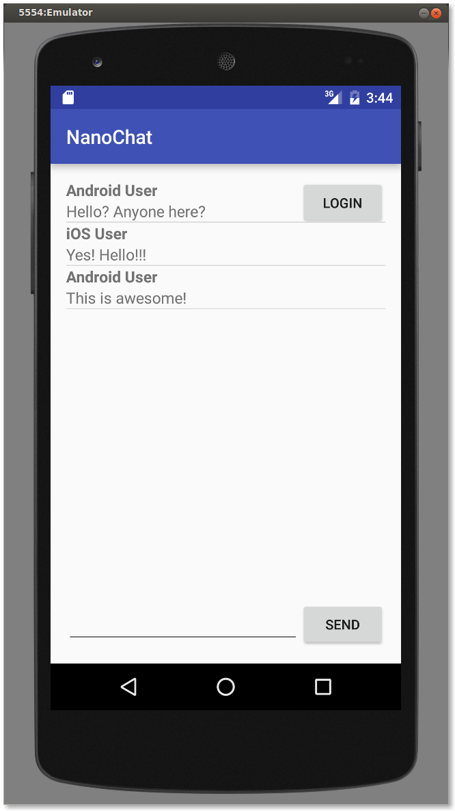


What you'll learn:

 * Interacting with Firebase from an Android application

The steps:

1. [Register with Firebase](#register-with-firebase)
2. [Create a project in Android Studio](#create-a-project-in-android-studio)
3. [Connect the Android app to Firebase](#connect-the-android-app-to-firebase)
4. [Send a message](#send-a-message)
5. [Show the messages](#show-the-existing-and-new-messages)
6. [Enable login](#enable-e-mailpassword-login)

What you'll need
 * [Android Studio](https://developer.android.com/sdk/installing/studio.html) version 1.3 or up
 * A test device or emulator with Android 2.3.3 or up
 * The device must have internet access to the Firebase servers
 * While we'll show you what to do in Android Studio, this code lab does not explain how Android works

## Register with Firebase

The first step is to create a Firebase application. This will be the server-side component that our Android application talks to.

1. Go to the [Firebase web site](https://www.firebase.com/)
2. Login or sign up

  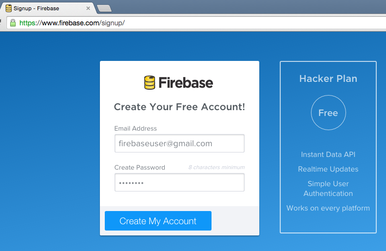

3. Manage the app that was automatically created for you

  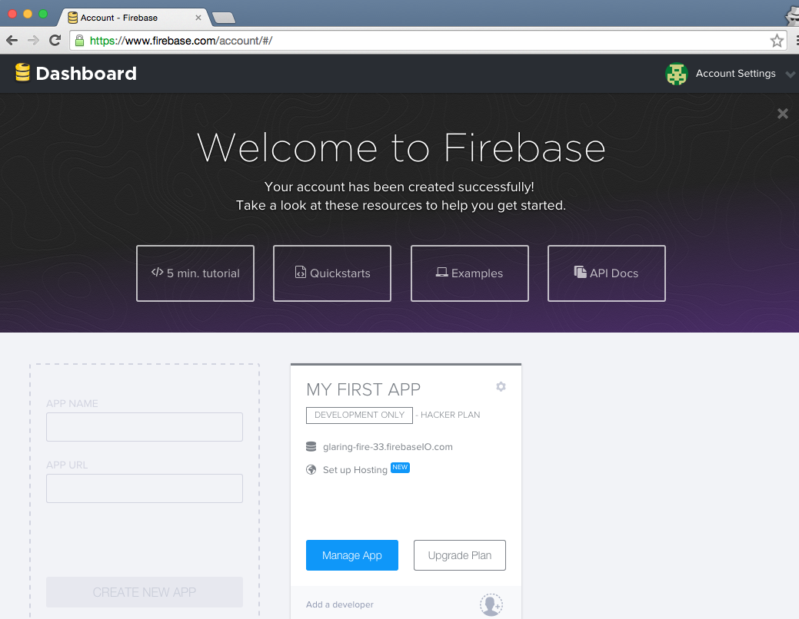

  This app is on Firebase's free hacker plan. This plan is great for when you're developing your app on Firebase.
4. Any data that our Android application writes, will be visible in the Data tab

  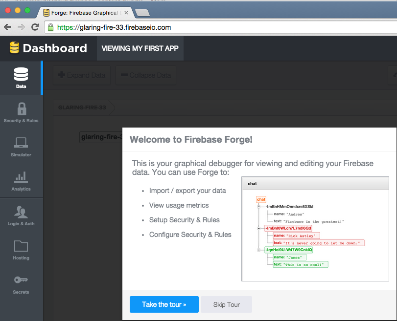

The custom Firebase backend for our application is now ready for use. Let's set up our app in Android Studio.

## Create a project in Android Studio

In this step we'll create a project in Android Studio.

1. Start Android Studio and Start a new Android Studio project

  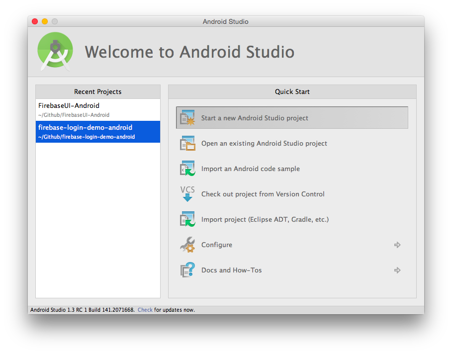

2. You can name the project anything you want. But in the code below, we've named it Nanochat

  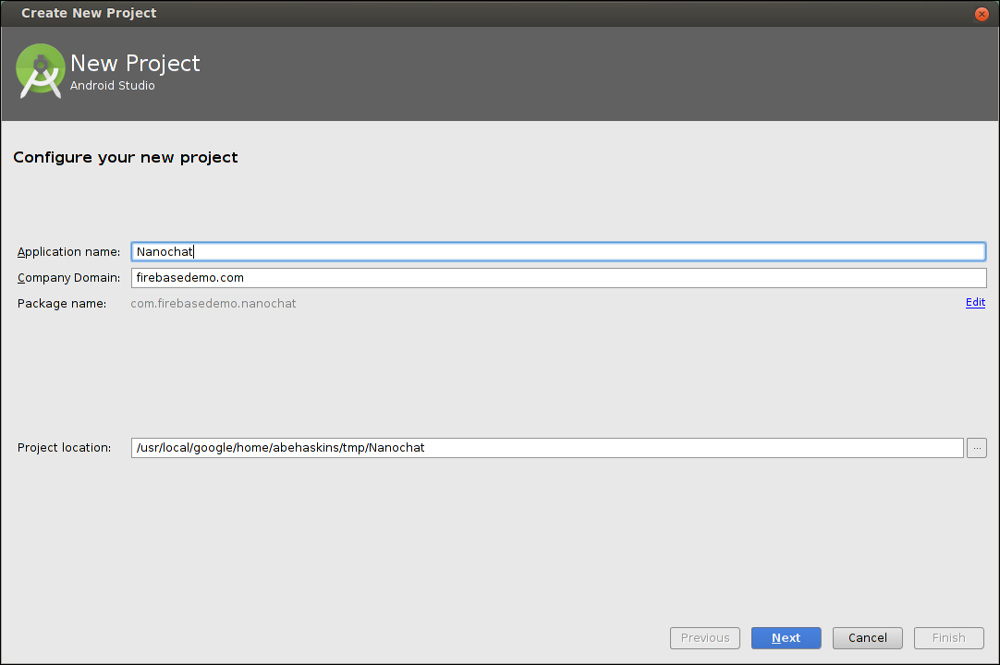

3. Set the minimum SDK to 10 or higher.

  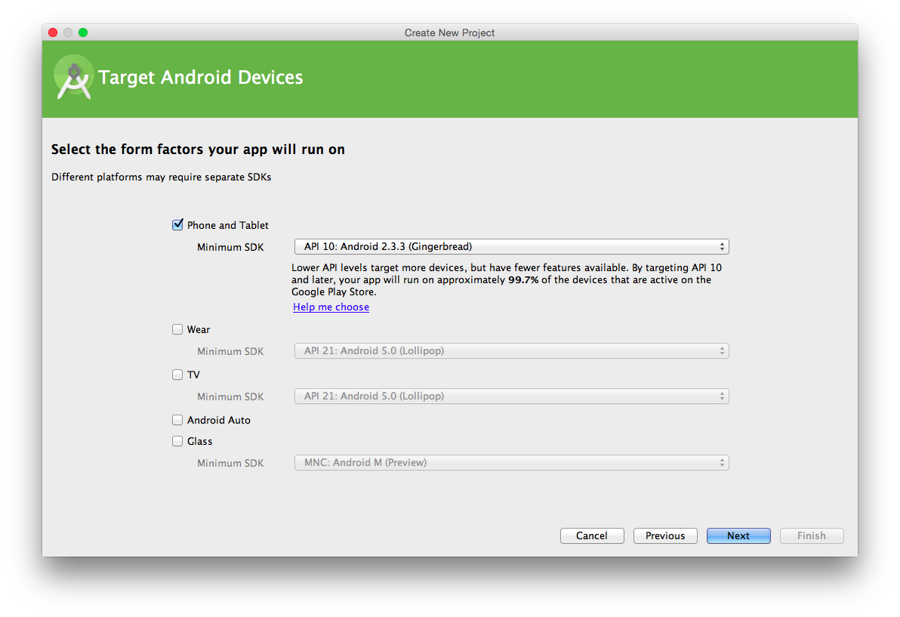

   We've left it on 10 (Gingerbread) here, since that is the lowest API level Firebase supports.
4. Start with a Empty Activity

  

5. We'll leave all the defaults for this activity

  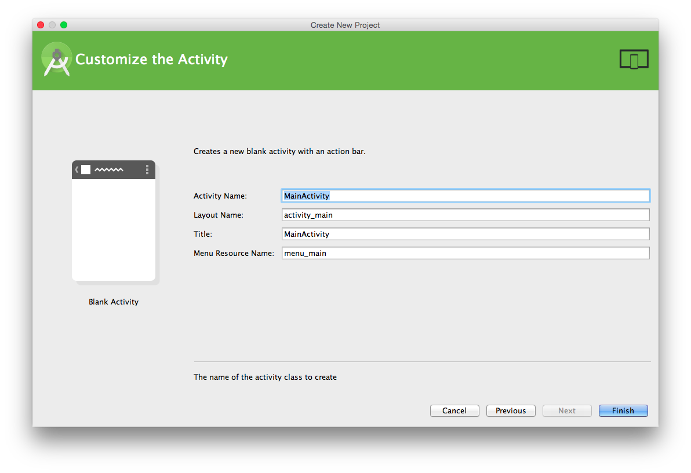

6. If the project outline is not visible on the left, click the 1:Project label

  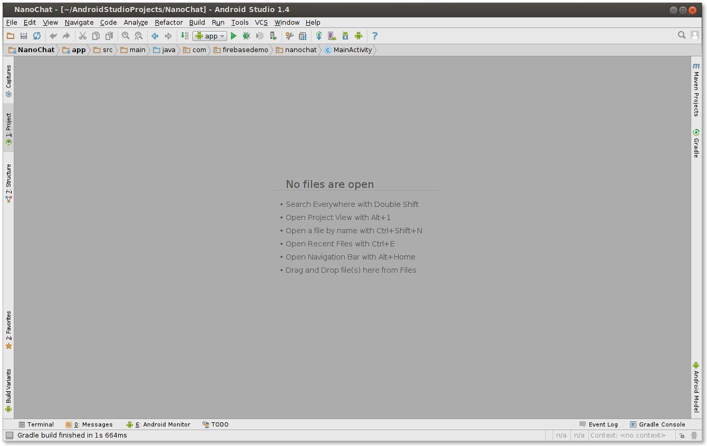

7. Open up the main activity, which can be found in `app/res/layout/activity_main.xml` and switch from its Design to its Text tab if needed. In this file the root element will be a `RelativeLayout` and in there will be a `TextView`. We won't be using the `TextView`, so delete it (or leave it and put a welcome message in it).

  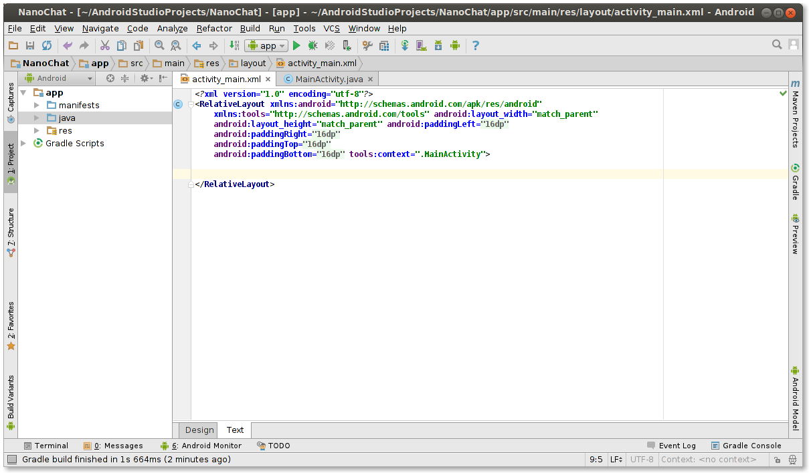

 We now have a blank project in Android Studio. Let's wire our app up to Firebase!

## Connect the Android app to Firebase

Before we can start writing code that interacts with our Firebase database, we'll need to make Android Studio aware that we'll be using Firebase. We need to do this in a few places: in the `gradle.build` script for our app and in its `AndroidManifest.xml`.

1. open Gradle Scripts > build.gradle (Module: app)

   This file contains the steps that Android Studio uses to build our app. We'll add a reference to Firebase to it, so we can start using it.

2. add the following lines to the dependencies object at the bottom:

        compile 'com.firebase:firebase-client-android:2.5.0'
        compile 'com.firebaseui:firebase-ui:0.3.0'

  This tells Gradle to include the Firebase SDK and the FirebaseUI library.

3. Add the following inside the `android` object:

        packagingOptions {
            exclude 'META-INF/LICENSE'
            exclude 'META-INF/LICENSE-FIREBASE.txt'
            exclude 'META-INF/NOTICE'
        }

  This tells Gradle to exclude some files that otherwise create conflicts during the build.

  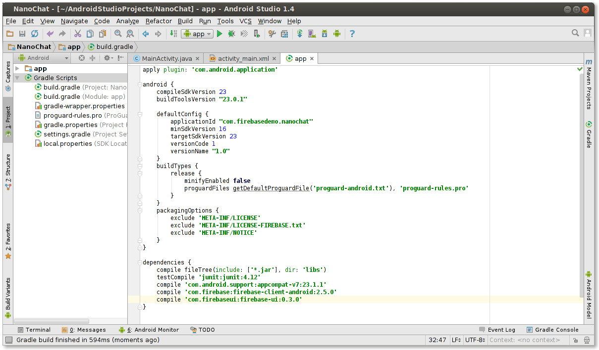

4. At this stage you'll need to synchronize the project with the gradle files again. Either click the Sync Now link in the notification bar or the corresponding button in the toolbar: Sync Project with Gradle Files.

    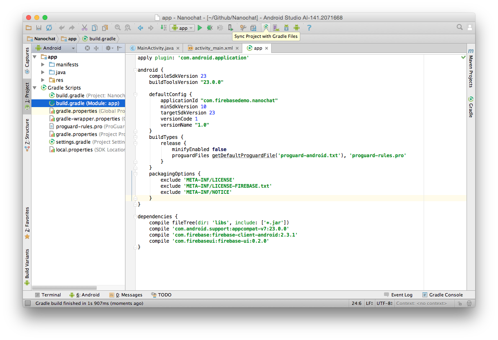

  Android Studio will parse the gradle files and pick up our changes.

5. Since Firebase is a hosted service, our app will need to be able to access the internet.
6. Open app > manifests > AndroidManifest.xml
7. Add this line inside the `manifest` element:

```html
<uses-permission android:name="android.permission.INTERNET" />
```

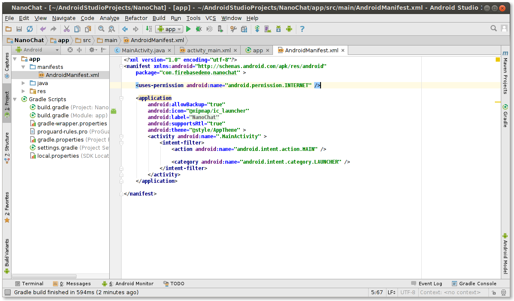

8. Import Firebase at the top of your MainActivity by adding the following line:

```java
import com.firebase.client.Firebase;
```

9. Now we can get to the Java code. The first step there is to set up initial connection between our code and its Firebase backend.
open `MainActivity.java` and add this code to the end of the `onCreate` method:

```java
Firebase.setAndroidContext(this);
```

  This code allows the Firebase client to keep its context.
10. If Android Studio is having trouble finding the Firebase class, be sure that you've added dependencies and have synchronized the build file with the project.
11. We also want to create a connection to our database. We'll keep this connection in a member field:

```java
private Firebase mFirebaseRef;
```

  that we initialize in onCreate:

```java
mFirebaseRef = new Firebase("https://<your-app>.firebaseio.com");
```

  Be sure to replace `<your-app>` with the name of the Firebase app you created in the first section.

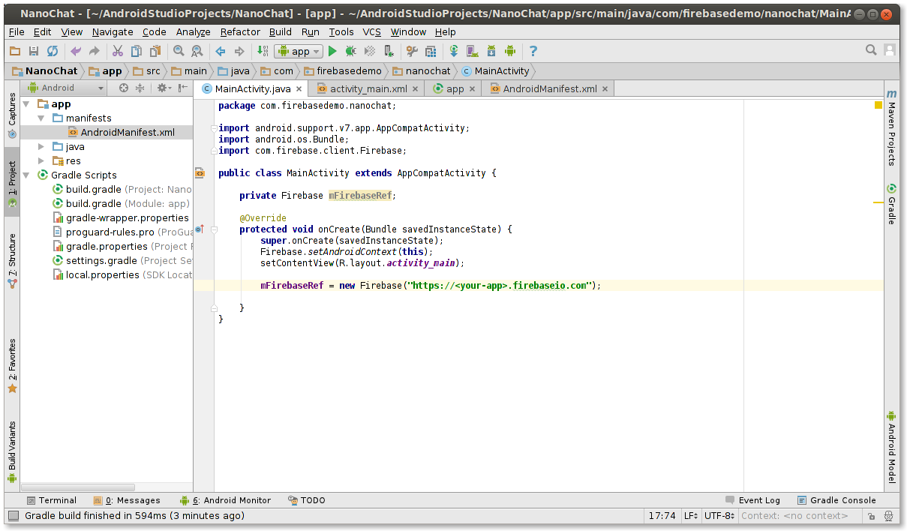

That's all the setup that is required. Next up we'll allow the user to enter a message in our app and send the message to Firebase.

## Send a message

Next we'll send data to Firebase! In this step we'll allow the user to enter a message in a text box. When they then click the Send button, we will send the message to Firebase.

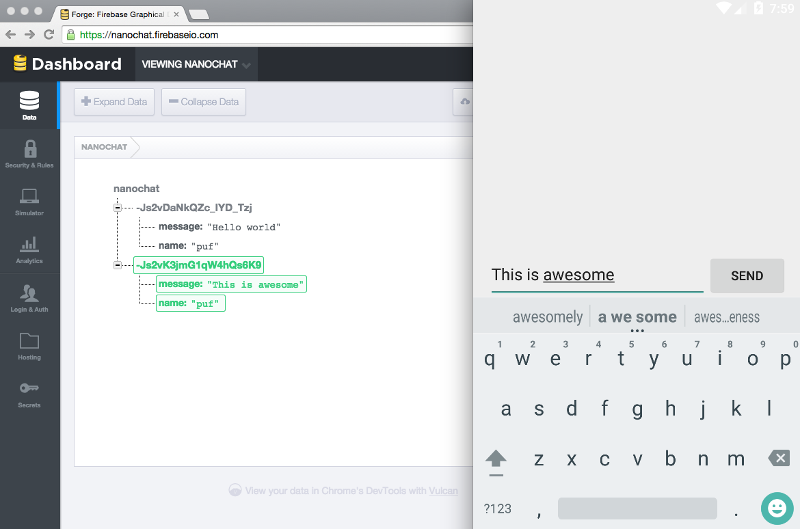

1. We'll first add the necessary views to activity_main.xml:

```xml
<LinearLayout
    android:id="@+id/footer"
    android:layout_alignParentBottom="true"
    android:layout_width="match_parent"
    android:layout_height="wrap_content"
    android:orientation="horizontal">
    <EditText
        android:id="@+id/text_edit"
        android:layout_width="0dp"
        android:layout_weight="1"
        android:layout_height="wrap_content"
        android:singleLine="true"
        android:inputType="textShortMessage" />
    <Button
        android:id="@+id/send_button"
        android:layout_width="wrap_content"
        android:layout_height="wrap_content"
        android:text="Send" />
</LinearLayout>
```

  This layout puts a horizontal bar at the bottom that contains an `EditText`, where the user can enter their chat message, and a `Button` that they can click to send the message.

  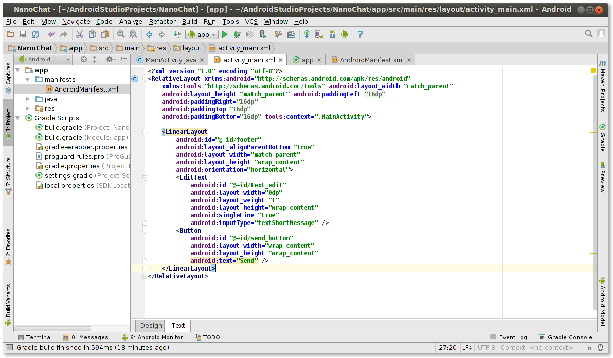

2. In our `MainActivity.java` we'll now add variables for the `EditText` and `Button` at the end of the onCreate method:

```java
final EditText textEdit = (EditText) this.findViewById(R.id.text_edit);
Button sendButton = (Button) this.findViewById(R.id.send_button);
```

  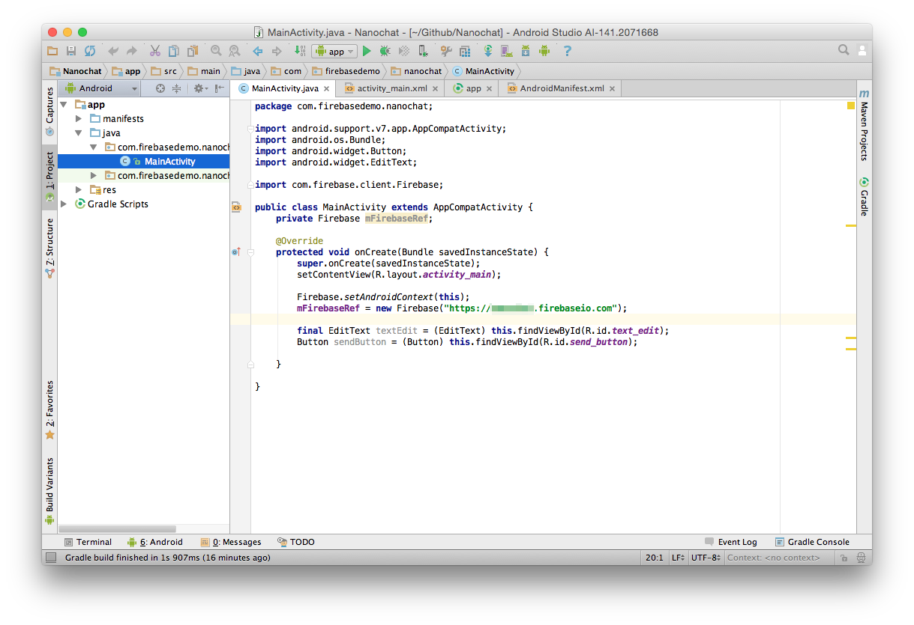

3. Next, we'll add a method that grabs the text from the input and send it to our Firebase database:

```java
sendButton.setOnClickListener(new View.OnClickListener() {
    @Override
    public void onClick(View v) {
        String text = textEdit.getText().toString();
        Map<String,Object> values = new HashMap<>();
        values.put("name", "Android User");
        values.put("text", text);
        mFirebaseRef.push().setValue(values);
        textEdit.setText("");
    }
});
```

  You will have to import the packages for some of these classes. Android Studio will tell you where to import them from.

  Here we grab the message from the EditText, add it to a Map, and send it off to Firebase. We'll look at a way to replace that Map with something more type-safe in the next section, but for now this will work.

  We hard-coded our user name for the moment. We'll use Firebase Authentication to make this dynamic in the last section of this code lab.

  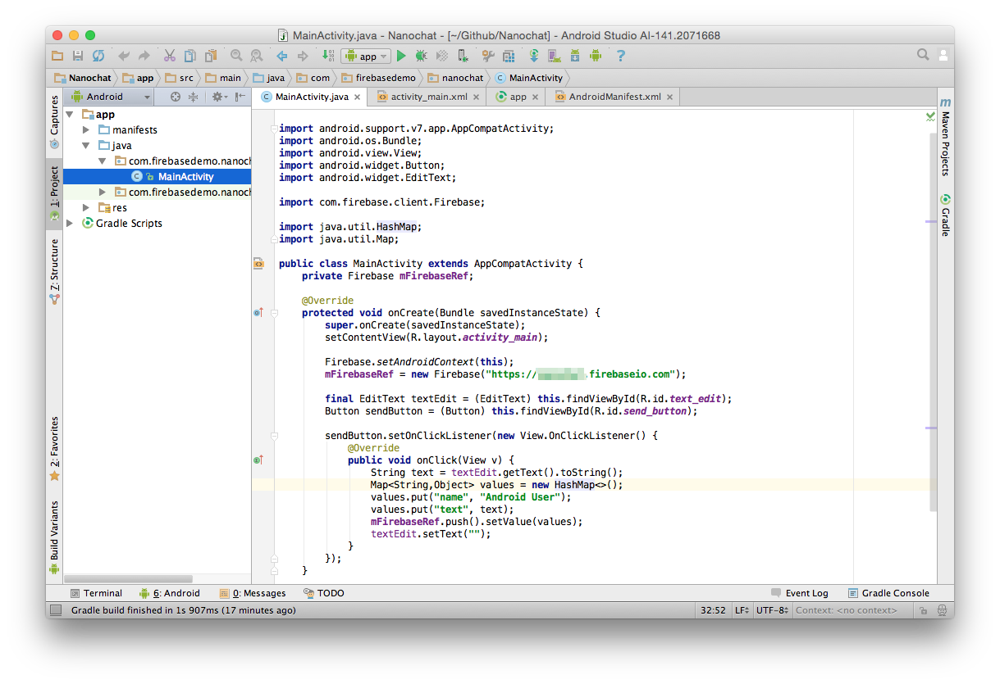

5. If you now run the application in the emulator, you will see an input field with a Send button that sends the message to Firebase. Open the URL of your Firebase database, and you'll see it light up green as you add new messages.
6. Open the Data tab in the Firebase Dashboard of your app. You'll see it light up green as you add new messages. Admit it, this is pretty cool!

Now that we can send messages to Firebase, it is time for the next step: making the messages show up in our Android app in realtime.

## Show the (existing and new) messages

A chat app that doesn’t show existing messages is not very useful. So in this step we’ll add a list of the existing messages to our Android app. And since we're using Firebase, new chat messages will be added to this list automatically. At the end of this section we’ll have a fully functional chat app.

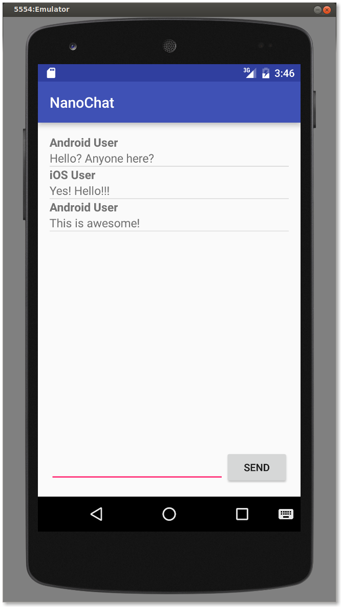

Let's take this in chunks: first we'll create a Java class to represent each message, then we'll create an Adapter that gets each of the messages from Firebase and puts them into a ListView.

1. As you can see in the screenshot, each chat message has the same layout. Instead of creating a custom layout, we'll use one of the built-in layouts of Android: `android.R.layout.two_line_list_item`. We'll show the user name on the first line (in bold) and the message text on the second line.
2. Create a class `ChatMessage.java` that wraps the username and text message:

```java
public class ChatMessage {
    private String name;
    private String text;

    public ChatMessage() {
      // necessary for Firebase's deserializer
    }
    public ChatMessage(String name, String text) {
        this.name = name;
        this.text = text;
    }

    public String getName() {
        return name;
    }

    public String getText() {
        return text;
    }
}
```

  As you can see, this is plain-old Java object. But it’s a POJO with some special traits. First `ChatMessage` follows a JavaBean pattern for its property names. The `getName` method is a getter for a `name` property, while `getText()` is a getter for a `text` property. And second, those property names correspond to the ones we’ve been using when we sent messages to Firebase in our `OnClickListener`.

  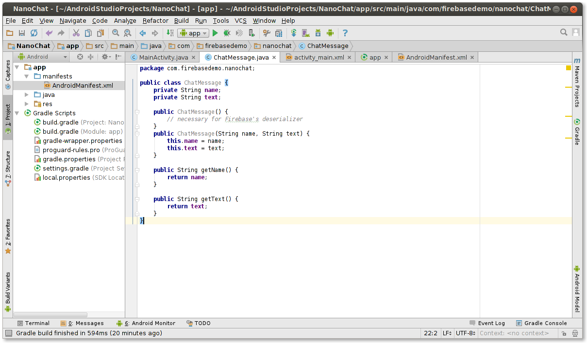

  Warning: if you end up making this `ChatMessage` an inner class of another class, you must make it static: `public static class ChatMessage`.

3. With the layout for the message specified and their structure defined in a class, we need to make a space for them in the `main_activity.xml`

  Add a ListView with `android:id="@android:id/list"`` above the LinearLayout:

```xml
<ListView
    android:id="@android:id/list"
    android:layout_width="match_parent"
    android:layout_height="match_parent"
    android:layout_above="@+id/footer"/>
```

  This is the container that all messages will be added to: one message_layout for each ChatMessage.

  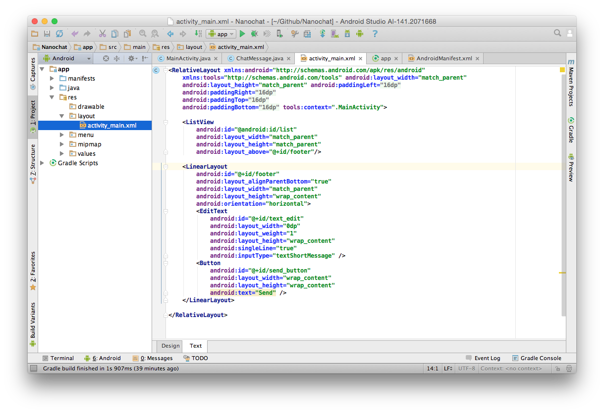

  The `id` value is very important here, since Android's `ListActivity` uses it to find the `ListView`. So make sure to enter it exactly as specified: ``@android:id/list`.

4. Make the `MainActivity` class descend from `ListActivity`. This is a built-in Android base-class. By deriving from this, our activity will automatically have access to the ListView we added to the layout:

```java
public class MainActivity extends ListActivity {
```

5. We're ready to start on our ListAdapter, which we'll base on the `FirebaseListAdapter` from the firebase-ui project we imported. `The FirebaseListAdapter` class adapts a Firebase collection so that it becomes usable in an Android `ListView`. First we'll add a member to our `MainActivity`:

```java
public class MainActivity extends ListActivity {
    private Firebase mFirebaseRef;
    FirebaseListAdapter<ChatMessage> mListAdapter;
```

  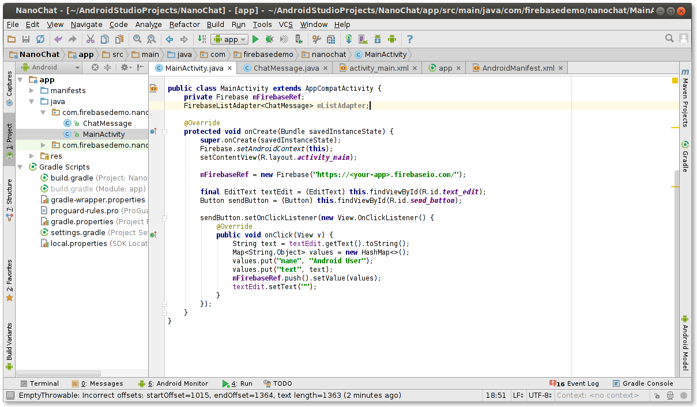

6. To make everything come together, we add this to the onCreate method of our MainActivity:

```java
mListAdapter = new FirebaseListAdapter<ChatMessage>(this, ChatMessage.class,
        android.R.layout.two_line_list_item, mFirebaseRef) {
    @Override
    protected void populateView(View v, ChatMessage model, int position) {
        ((TextView)v.findViewById(android.R.id.text1)).setText(model.getName());
        ((TextView)v.findViewById(android.R.id.text2)).setText(model.getText());
    }
};
setListAdapter(mListAdapter);
```

  The FirebaseListAdapter maps the data from your Firebase database into the ListView that you added to the layout. It creates a new instance of your `two_line_list_item` for each `ChatMessage` and calls the `populateView` method. We override this method and put the name and text in the correct subviews.

  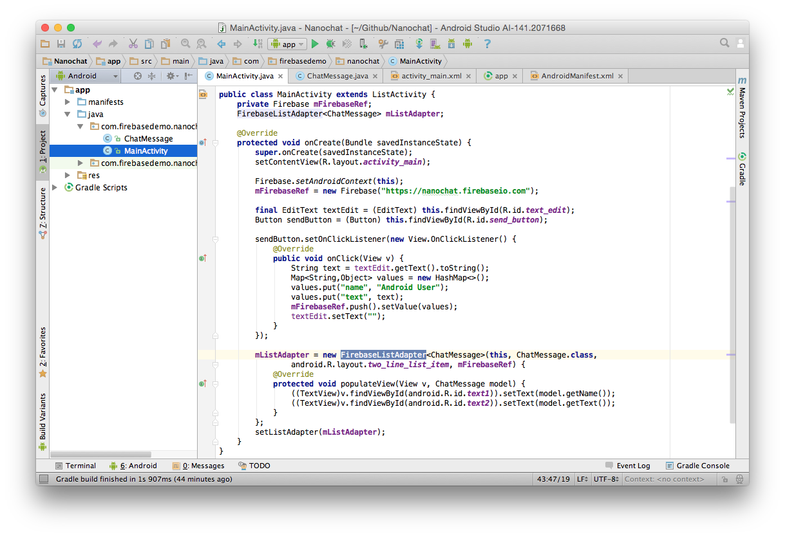

7. Don't worry, the hardest part is behind us now. All that is left in this step is some clean-up. But before that, run your app and see that it shows all existing messages. And if you send a new message, it shows up in the emulator and in your Firebase dashboard.

8. The cleanup is minor, but it's important to keep our code as readable as possible at all times. Remember that onSendButtonClick method that we wrote in step 5? That use of a Map looked a bit messy. Now that we have a ChatMessage class, we can make it much more readable:

```java
sendButton.setOnClickListener(new View.OnClickListener() {
    @Override
    public void onClick(View v) {
        String text = textEdit.getText().toString();
        ChatMessage message = new ChatMessage("Android User", text);
        mFirebaseRef.push().setValue(message);
        textEdit.setText("");
    }
});
```

9. Finally, we also need to clean up our list adapter when the activity is destroyed. This will close the connection to the Firebase server, when the activity is not showing.

```java
@Override
protected void onDestroy() {
    super.onDestroy();
    mListAdapter.cleanup();
}
```

  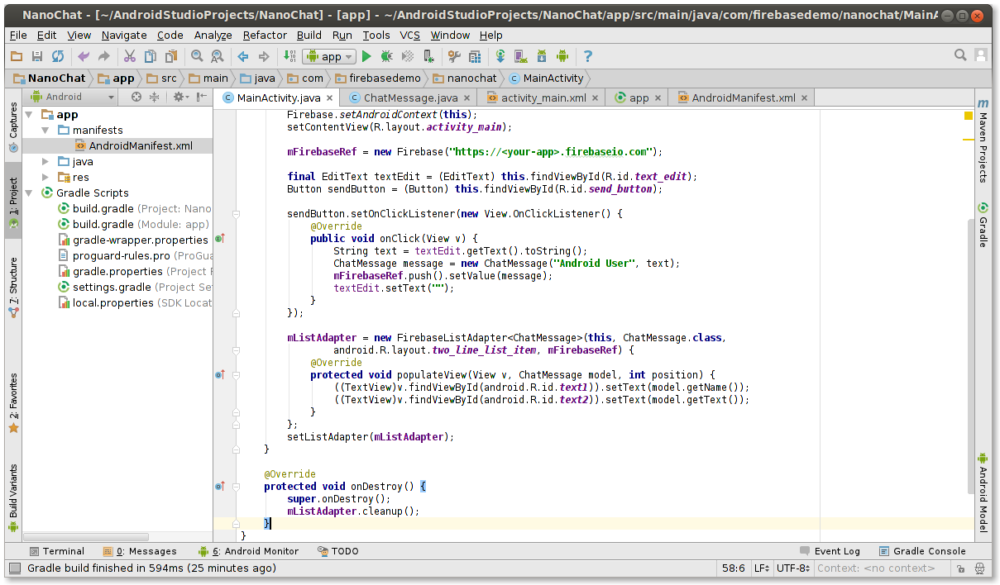

In this section we made our app show the chat messages. It was a lot of work, but in the end you can see that the Java code for our main activity still fits in a single screenshot.

## Enable e-mail+password login

As a final step, we're going to allow the users of our app to log in using email and password.

1. In the Login & Auth tab of your Firebase dashboard, enable Email & Password authentication

  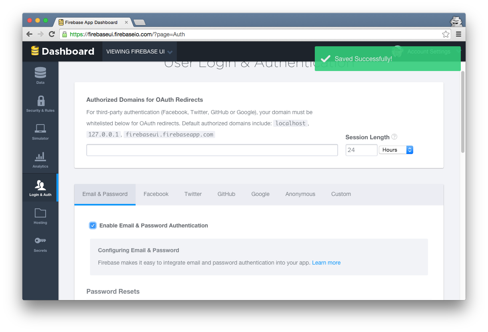

2. First add a button to the top right of activity_main.xml

```xml
<Button
    android:layout_width="wrap_content"
    android:layout_height="wrap_content"
    android:text="Login"
    android:id="@+id/login"
    android:layout_alignTop="@android:id/list"
    android:layout_alignRight="@android:id/list"
    android:layout_alignEnd="@android:id/list" />
```

  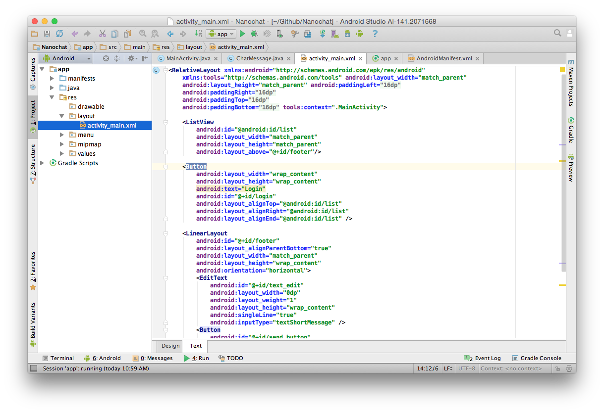

3. Extend FirebaseLoginBaseActivity

Although extending `ListActivity` was useful earlier, when it saved some lines of code, it's now more important that we extend `FirebaseLoginBaseActivity`.

We'll change our `MainActivity` definition to extend `FirebaseLoginBaseActivity`.

```java
public class MainActivity extends FirebaseLoginBaseActivity {
```

Then we need to update our usage of FirebaseListAdapter.

```java
final ListView listView = (ListView) this.findViewById(android.R.id.list);

mListAdapter = new FirebaseListAdapter<ChatMessage>(this, ChatMessage.class,
        android.R.layout.two_line_list_item, mFirebaseRef) {
    @Override
    protected void populateView(View v, ChatMessage model, int position) {
        ((TextView)v.findViewById(android.R.id.text1)).setText(model.getName());
        ((TextView)v.findViewById(android.R.id.text2)).setText(model.getText());
    }
};
listView.setAdapter(mListAdapter);
```

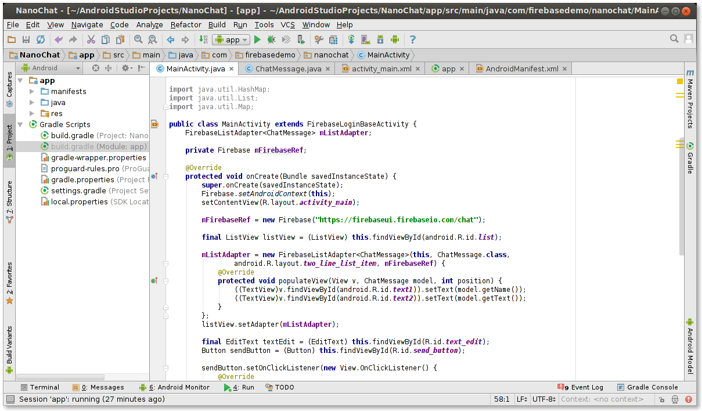

Finally we need to add a few event handlers onto `MainActivity` so we can react to login events.

```java
@Override
protected Firebase getFirebaseRef() {
    return mFirebaseRef;
}

@Override
protected void onFirebaseLoginProviderError(FirebaseLoginError firebaseLoginError) {

}

@Override
protected void onFirebaseLoginUserError(FirebaseLoginError firebaseLoginError) {

}
```

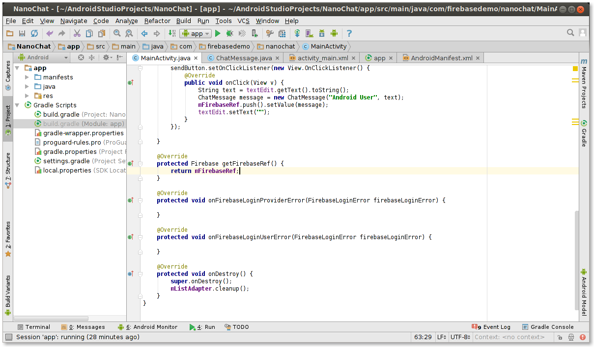

4. Enable Password Authentication

```java
@Override
protected void onStart() {
    super.onStart();
    setEnabledAuthProvider(AuthProviderType.PASSWORD);
}
```

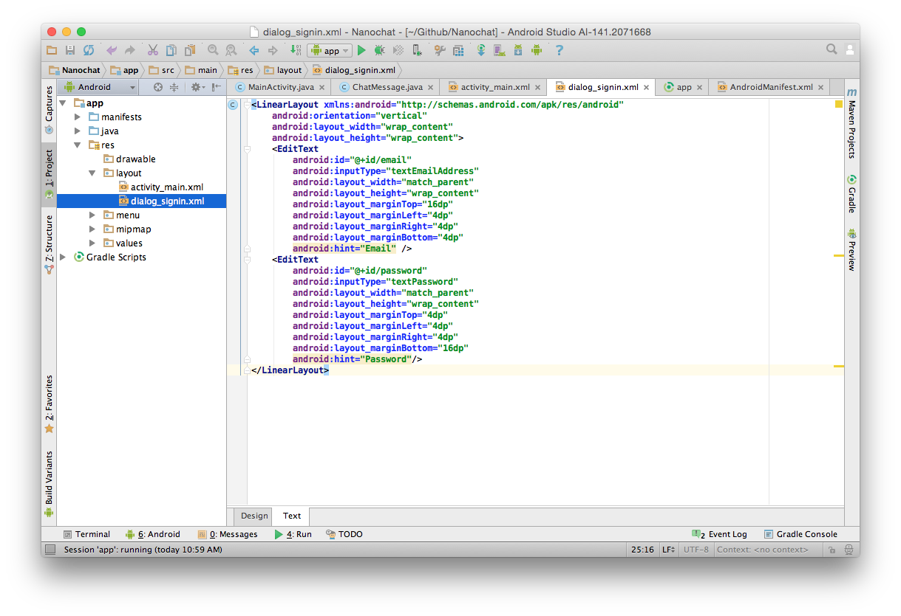

5. Wire up login button

```java
Button loginButton = (Button) this.findViewById(R.id.login);

loginButton.setOnClickListener(new View.OnClickListener() {
    @Override
    public void onClick(View v) {
        showFirebaseLoginPrompt();
    }
});
```

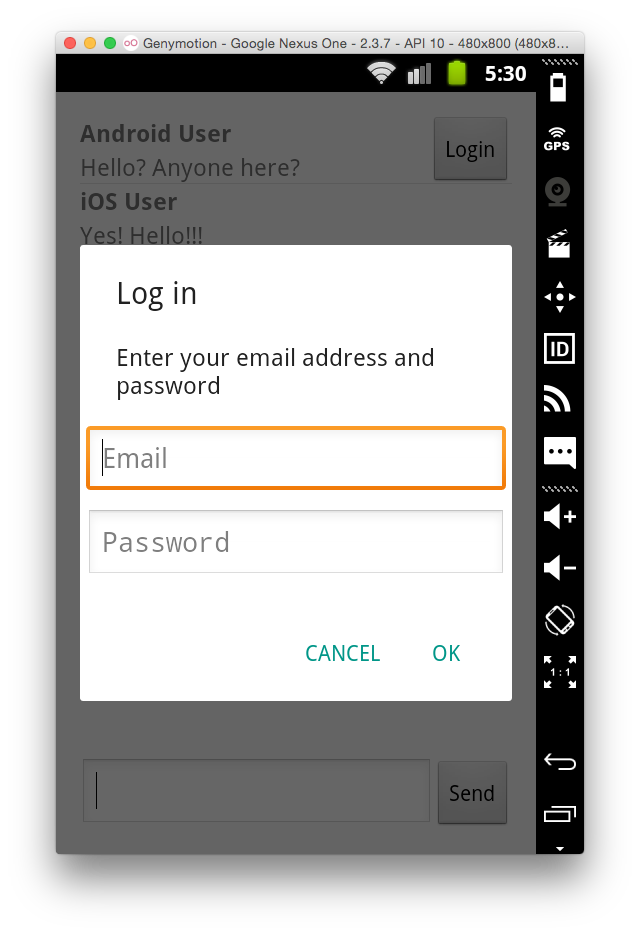

Now go into your Firebase Dashboard and go to the Auth tab and select "Email/Password". You'll see an "Add User" button. Create a user to test logging in with.

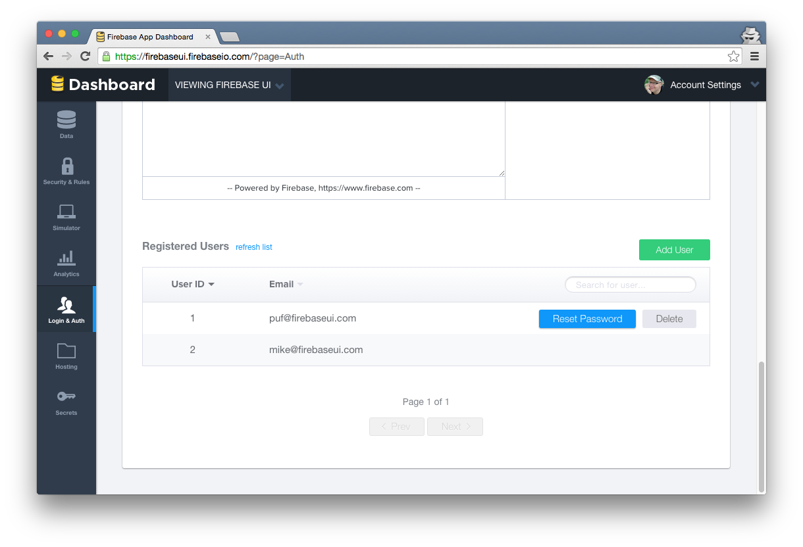

This is also where you can configure the password reset emails that you can send to your users, in case they forgot their password.

## Wrap-up

Wrap-up

Congratulations! You've just built a fully functional multi-user chat application that uses Firebase to store the data and authentication users.


As a reward for finishing the codelab you’ve earned a promo code! When you’re ready to put your Firebase app in production, you can use the promo code `androidcodelab49` for $49 off your first month of a paid Firebase plan. Just enter the code when you upgrade your Firebase.

What we've covered
 * Interacting with a Firebase Database from an Android application.
 * Using Firebase Authentication in an Android application to authenticate users.

Next Steps
* Add a log-out button to the app
* Add a password-reset button to the login dialog
* Use a RecyclerView (and [`FirebaseRecyclerViewAdapter`](https://github.com/firebase/FirebaseUI-Android/#using-a-recyclerview)) to ensure the activity also performs well when there are lots of messages
* Allow the user to specify a nickname or use one of the Firebase's social authentication providers to look up their first name.
* Get your app on the Play Store!

Learn More
* Learn all about using [Firebase with Android](https://www.firebase.com/docs/android/) by following the [Firebase for Android development guide](https://www.firebase.com/docs/android/guide/).
* Study a more advanced sample application: [AndroidDrawing](https://github.com/firebase/AndroidDrawing).
* Learn about [GeoFire for Java](https://github.com/firebase/geofire-java), which allows you to add realtime location queries to your Android application
