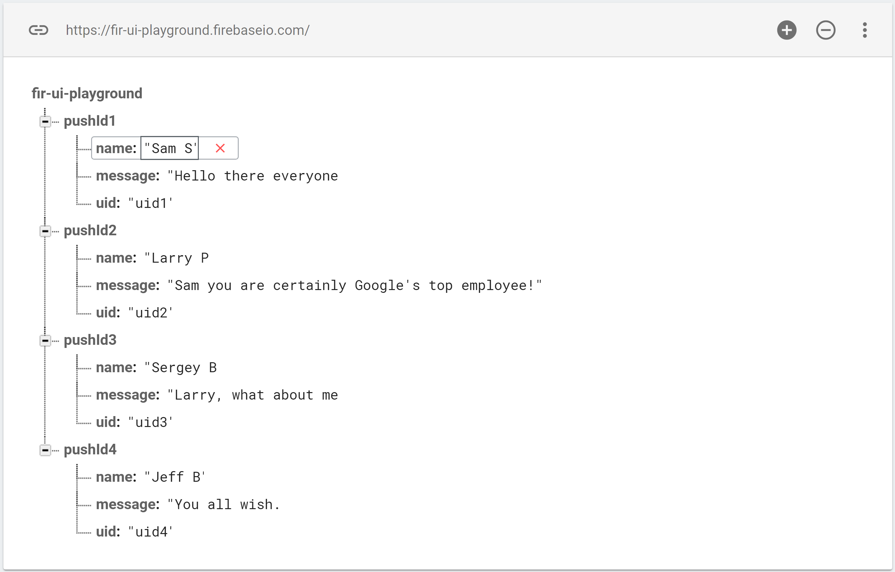

# firebase-ui-database

## Using FirebaseUI to Populate a ListView

To use the FirebaseUI to display Firebase data, we need a few things:

  1. A Java class that represents our database objects
  1. A custom list adapter to map from a collection from Firebase to Android

### Creating a model class

In your app, create a class that represents the data from Firebase that you want to show in the ListView.

So say we have these chat messages in our Firebase database:



We can represent a chat message with this Java class:

```java
public static class Chat {

        String name;
        String text;
        String uid;

        public Chat() {
        }

        public Chat(String name, String uid, String message) {
            this.name = name;
            this.text = message;
            this.uid = uid;
        }

        public String getName() {
            return name;
        }

        public String getUid() {
            return uid;
        }

        public String getText() {
            return text;
        }
}
```
A few things to note here:

 * The fields have the exact same name as the properties in Firebase. This allows Firebase to automatically map the properties to these fields.
 * There is a default (parameterless constructor) that is necessary for Firebase to be able to create a new instance of this class.
 * There is a convenience constructor that takes the member fields, so that we easily create a fully initialized `Chat` in our app
 * the `getText`, `getUid`, and `getName` methods are so-called getters and follow a JavaBean pattern

A little-known feature of Firebase for Android is that you can pass an instance of this `Chat` class to `setValue()`:

```java
DatabaseReference ref = FirebaseDatabase.getInstance().getReference();
Chat msg = new Chat("puf", "1234", "Hello FirebaseUI world!");
ref.push().setValue(msg);
```
The Firebase Android client will read the values from the `msg` and write them into the properties of the new child in the database.

Conversely, we can read a `Chat` straight from a `DataSnapshot` in our event handlers:

```java
ref.limitToLast(5).addValueEventListener(new ValueEventListener() {
    @Override
    public void onDataChange(DataSnapshot snapshot) {
        for (DataSnapshot msgSnapshot: snapshot.getChildren()) {
            Chat msg = msgSnapshot.getValue(Chat.class);
            Log.i("Chat", chat.getName()+": "+chat.getText());
        }
    }
    @Override
    public void onCancelled(DatabaseError firebaseError) {
        Log.e("Chat", "The read failed: " + firebaseError.getText());
    }
});
```
In the above snippet we have a query for the last 5 chat messages. Whenever those change (i.e. when an new message is added)
we get the `Chat` objects from the `DataSnapshot` with `getValue(Chat.class)`. The Firebase Android client will
then read the properties that it got from the database and map them to the fields of our `Chat` class.

But when we build our app using FirebaseUI, we often won't need to register our own EventListener. The
`FirebaseListAdapter` takes care of that for us.

### Find the ListView

We'll assume you've already added a `ListView` to your layout and have looked it up in the `onCreate` method of your activity:

```java
@Override
protected void onCreate(Bundle savedInstanceState) {
    super.onCreate(savedInstanceState);
    setContentView(R.layout.activity_main);

    ListView messagesView = (ListView) findViewById(R.id.messages_list);
}
```

### Connect to Firebase

First we'll set up a reference to the database of chat messages:

```java
@Override
protected void onCreate(Bundle savedInstanceState) {
    super.onCreate(savedInstanceState);
    setContentView(R.layout.activity_main);

    ListView messagesView = (ListView) findViewById(R.id.messages_list);

    DatabaseReference ref = FirebaseDatabase.getInstance().getReference();
}
```

### Create custom FirebaseListAdapter subclass

Next, we need to create a subclass of the `FirebaseListAdapter` with the correct parameters and implement its `populateView` method:

```java
@Override
protected void onCreate(Bundle savedInstanceState) {
    super.onCreate(savedInstanceState);
    setContentView(R.layout.activity_main);

    ListView messagesView = (ListView) findViewById(R.id.messages_list);

    DatabaseReference ref = FirebaseDatabase.getInstance().getReference();
    
    mAdapter = new FirebaseListAdapter<Chat>(this, Chat.class, android.R.layout.two_line_list_item, ref) {
        @Override
        protected void populateView(View view, Chat chatMessage, int position) {
            ((TextView)view.findViewById(android.R.id.text1)).setText(chatMessage.getName());
            ((TextView)view.findViewById(android.R.id.text2)).setText(chatMessage.getText());

        }
    };
    messagesView.setAdapter(mAdapter);
}
```

In this last snippet we create a subclass of `FirebaseListAdapter`.
We tell is that it is of type `<Chat>`, so that it is a type-safe collection. We also tell it to use
`Chat.class` when reading messages from the database. Next we say that each message will be displayed in
a `android.R.layout.two_line_list_item`, which is a built-in layout in Android that has two `TextView` elements
under each other. Then we say that the adapter belongs to `this` activity and that it needs to monitor the
data location in `ref`.

We also have to override the `populateView()` method, from the `FirebaseListAdapter`. The
`FirebaseListAdapter` will call our `populateView` method for each `Chat` it finds in the database.
It passes us the `Chat` and a `View`, which is an instance of the `android.R.layout.two_line_list_item`
we specified in the constructor. So what we do in our subclass is map the fields from `chatMessage` to the
correct `TextView` controls from the `view`. The code is a bit verbose, but hey... that's Java and Android for you.

### Clean up When the Activity is Destroyed

Finally, we need to clean up after ourselves. When the activity is destroyed, we need to call `cleanup()`
on the `ListAdapter` so that it can stop listening for changes in the Firebase database.

```java
@Override
protected void onDestroy() {
    super.onDestroy();
    mAdapter.cleanup();
}
```

### Send Chat Messages

Remember when we showed how to use the `Chat` class in `setValue()`.
We can now use that in our activity to allow sending a message:

```java
@Override
protected void onCreate(Bundle savedInstanceState) {
    super.onCreate(savedInstanceState);
    setContentView(R.layout.activity_main);

    ListView messagesView = (ListView) findViewById(R.id.messages_list);

    DatabaseReference ref = FirebaseDatabase.getInstance().getReference();

    mAdapter = new FirebaseListAdapter<Chat>(this, Chat.class, android.R.layout.two_line_list_item, ref) {
        @Override
        protected void populateView(View view, Chat chatMessage, int position) {
            ((TextView)view.findViewById(android.R.id.text1)).setText(chatMessage.getName());
            ((TextView)view.findViewById(android.R.id.text2)).setText(chatMessage.getText());
        }
    };
    messagesView.setAdapter(mAdapter);

    final EditText mMessage = (EditText) findViewById(R.id.message_text);
    findViewById(R.id.send_button).setOnClickListener(new View.OnClickListener() {
        @Override
        public void onClick(View v) {
            ref.push().setValue(new Chat("puf", "1234", mMessage.getText().toString()));
            mMessage.setText("");
        }
    });
}

@Override
protected void onDestroy() {
    super.onDestroy();
    mAdapter.cleanup();
}
```

You're done! You now have a minimal, yet fully functional, chat app in about 30 lines of code. Not bad, right?

## Using FirebaseUI to Populate a RecyclerView

RecyclerView is the new preferred way to handle potentially long lists of items. Since Firebase collections
can contain many items, there is an `FirebaseRecyclerAdapter` too. Here's how you use it:

1. Create a custom ViewHolder class
2. Create a custom subclass FirebaseRecyclerAdapter

The rest of the steps is the same as for the `FirebaseListAdapter` above, so be sure to read that first.

### Create a custom ViewHolder

A ViewHolder is similar to container of a ViewGroup that allows simple lookup of the sub-views of the group.
If we use the same layout as before (`android.R.layout.two_line_list_item`), there are two `TextView`s in there.
We can wrap that in a ViewHolder with:

```java
public static class ChatHolder extends RecyclerView.ViewHolder {
    View mView;

    public ChatHolder(View itemView) {
        super(itemView);
        mView = itemView;
    }

    public void setName(String name) {
        TextView field = (TextView) mView.findViewById(android.R.id.text1);
        field.setText(name);
    }

    public void setText(String text) {
        TextView field = (TextView) mView.findViewById(android.R.id.text2);
        field.setText(text);
    }
}
```

There's nothing magical going on here; we're just mapping numeric IDs and casts into a nice, type-safe contract.

### Create a custom FirebaseRecyclerAdapter

Just like we did for `FirebaseListAdapter`, we'll create an anonymous subclass for our Chats, but this time we'll use `FirebaseRecyclerAdapter`:

```java
RecyclerView recycler = (RecyclerView) findViewById(R.id.messages_recycler);
recycler.setHasFixedSize(true);
recycler.setLayoutManager(new LinearLayoutManager(this));

mAdapter = new FirebaseRecyclerAdapter<Chat, ChatHolder>(Chat.class, android.R.layout.two_line_list_item, ChatHolder.class, mRef) {
    @Override
    public void populateViewHolder(ChatHolder chatMessageViewHolder, Chat chatMessage, int position) {
        chatMessageViewHolder.setName(chatMessage.getName());
        chatMessageViewHolder.setText(chatMessage.getText());
    }
};
recycler.setAdapter(mAdapter);
```

Like before, we get a custom RecyclerView populated with data from Firebase by setting the properties to the correct fields.
