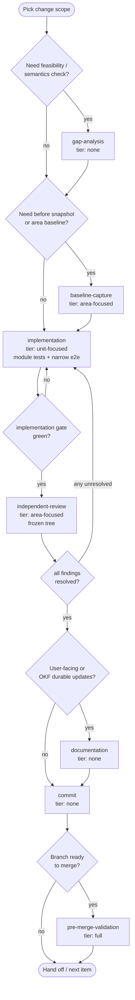
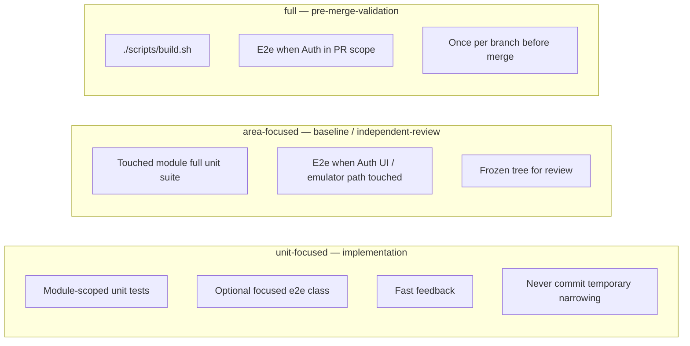
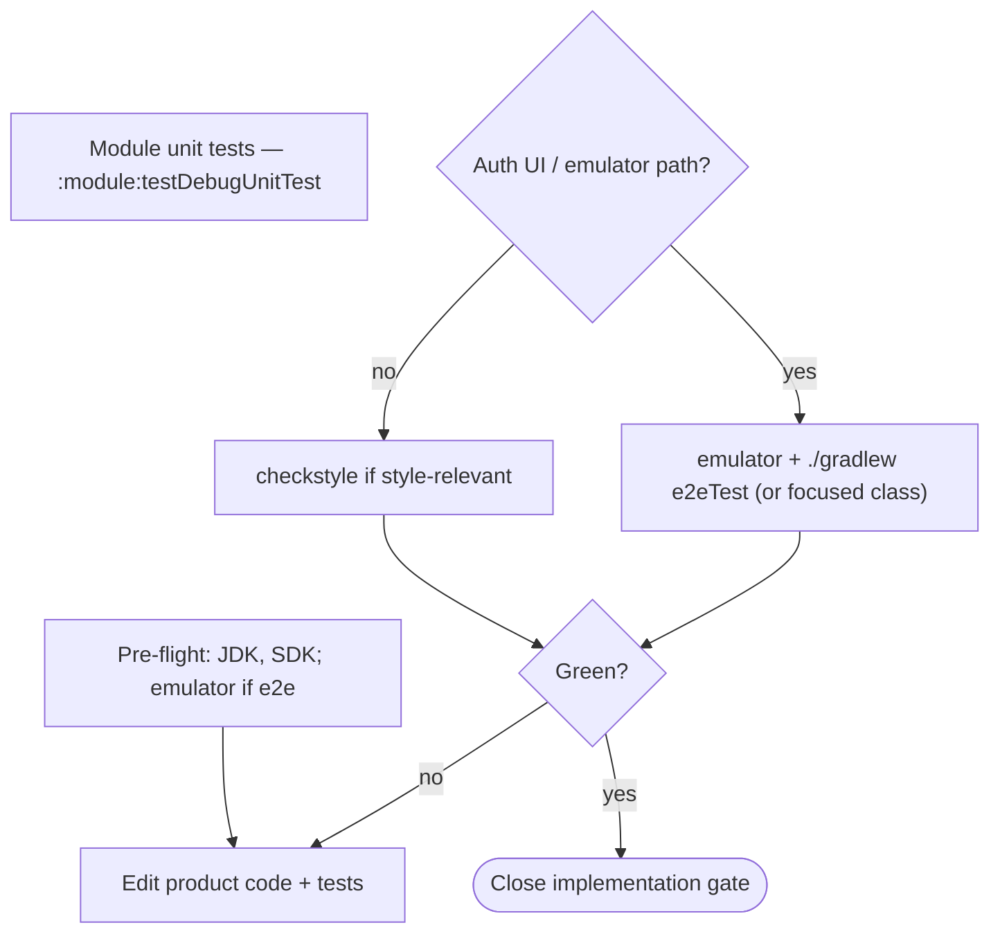

# Change authoring workflow

Single source for **how to author and verify a product change** in FirebaseUI-Android (bug fix, feature, migration follow-up). Module docs add artifacts; work queues add ephemeral gate state — neither restates this loop.

**Policy:** [OKF documentation and commit policy](../documentation-policy.md). **Terms:** [iteration vocabulary](iteration-vocabulary.md).

## Primary loop



## Work types

| Work type | When | Validation tier | Product edits | Commit |
|-----------|------|-----------------|---------------|--------|
| `gap-analysis` | Unclear feasibility, API shape, provider support | none | read-only | no |
| `baseline-capture` | Need before metrics or area-focused suite on the item | `area-focused` | local narrowing OK | no |
| `implementation` | Author fix/feature + tests | `unit-focused` | yes | no |
| `independent-review` | Verify frozen diff | `area-focused` | no — [frozen tree](#frozen-tree) | no |
| `documentation` | User docs + durable OKF updates | none | docs only | no |
| `commit` | Gates closed for the item | none | staging only | yes |
| `pre-merge-validation` | Branch merge gate | `full` | revert temporary narrowing first | no |

**Commands per work type:** [validation checklist](validation-checklist.md) — link only; do not duplicate here.

## Validation tiers

Tier id strings: [iteration vocabulary § validation tier identifiers](iteration-vocabulary.md#validation-tier-identifiers).



E2e scope and emulator rules: [running e2e § e2e agent rule](running-e2e.md#e2e-agent-rule).

**Command rule:** Agents run **only** [agent command policy](agent-command-policy.md) allowlisted commands — no improvised Gradle graphs or bare `firebase emulators:start`.

## Gates

| Gate | Closes when |
|------|-------------|
| `implementation` | `implementation` work type complete — code plus **unit-focused**-tier checks green; [static analysis](validation-checklist.md#lint-and-formatting) green on the diff; e2e green when Auth UI/emulator path changed |
| `review` | `independent-review` complete — **area-focused**-tier checks green on frozen tree; applicable [validation checklist](validation-checklist.md) rows green; **every review finding resolved** ([§ quality standards](#quality-standards)) |
| `commit` | Durable commit exists for the item **after** prior gates closed with [recorded evidence](#validation-evidence-blocking) |

**Trust rule:** Code on disk or in git with `review` still **open** is unverified until `independent-review` closes the gate.

Any unresolved review finding returns the item to **`implementation`** (`unit-focused`), then repeats **`independent-review`** (`area-focused`) — see [§ quality standards](#quality-standards).

<a id="validation-evidence-blocking"></a>

### Validation evidence (blocking)

Gates close **only** when **recorded evidence** shows the required validation tier ran and passed. Assumed green, implementer summaries without exit codes, or "tests passed earlier" without a log path **do not** close a gate.

| Gate | Minimum evidence (record in work-queue notes or review handoff) |
|------|------------------------------------------------------------------|
| **`implementation`** | Gradle/script **exit codes**; module unit test pass summary; when Auth UI/emulator path touched: **e2e pass** + log path; **`./gradlew checkstyle` exit code 0** when style-relevant sources changed |
| **`review`** | Frozen-tree re-run of area-focused checklist; checkstyle exit 0 when applicable; unit (+ e2e if Auth) evidence on the frozen tree |
| **`commit`** | Prior gates closed **with evidence**; no temporary test narrowing staged |
| **Publication** (`git push`, force-push, PR refresh) | **`review` gate closed on the exact commits being published**; evidence still valid (no product edits since last area-focused run) |

**Investigate before close:** Any review finding gets **root-cause analysis** — add tests, delete dead code, or record an [acceptable exception](#acceptable-exceptions) with evidence. Do not label gaps "informational" without proof.

<a id="forbidden-shortcuts"></a>

### Forbidden shortcuts

- **`git commit`** while the current work type's validation tier is incomplete or evidence is missing.
- **`git push` / force-push / PR update** claiming remediation or review-green **without** fresh area-focused evidence after the last product edit on the published commits.
- **History rewrite** (rebase, amend stack) **without** re-running validation for the rewritten scope — prior green results are **invalid**.
- **Self-accepted** gaps — only [acceptable exceptions](#acceptable-exceptions) with user confirmation or intractability evidence in durable OKF.

Publication is not a separate work type; it follows the same evidence bar as `review` + `commit`.

## Quality standards

Two authoring standards gate every item, and both admit the same narrow set of [acceptable exceptions](#acceptable-exceptions) — the only things that may be documented and tracked instead of fixed.

<a id="acceptable-exceptions"></a>

### Acceptable exceptions

Only two things may be documented and tracked instead of fixed. **Both require the user's explicit acceptance and confirmation plus a recorded rationale** — an agent or reviewer may not grant either on its own, and the item stays tracked until resolved.

1. **Intractable-limitation bar.** The gap is caused by an intractable technical limitation of the language, platform SDK, compiler, or toolchain, shown with evidence — e.g. a Firebase Auth API that does not expose the capability, cited by version.
2. **User-accepted deferral.** The gap is addressable, but the user explicitly defers it with a documented rationale.

Anything else is drift or a defect, never a self-justifying exception:

- **If code can be authored, a test that exercises it can be authored** — otherwise it is dead code; delete it, do not document it.
- Convenience, time pressure, "harmless", or "low-risk" carry weight **only** through an explicit user-accepted deferral (2), never on an agent's own authority.

<a id="review-findings--resolve-do-not-defer"></a>

### Review findings — resolve, do not defer

`independent-review` classifies findings **critical / serious / minor / nit**. The **`review` gate closes only when every finding — including minor and nit — is resolved by a fix**, unless the finding is covered by one of the two [acceptable exceptions](#acceptable-exceptions). An agent or reviewer may **not** defer a finding on its own authority: "green with minors" is not green.

A finding covered by an accepted exception is recorded — with evidence or the user's rationale — and tracked, not silently dropped. A finding that is neither fixed nor covered by an accepted exception returns the item to **`implementation`**.

## Frozen tree

Required for **`independent-review`** and for any e2e run that closes the **`review`** gate:

- No edits to library modules (`auth/`, `firestore/`, `database/`, `storage/`, `common/`), `e2eTest/`, `app/` product code, or bundle-affecting OKF docs during the run.
- Wait for or cancel in-flight runs before editing again.

Keep **`implementation`** and **`independent-review`** in separate passes.

## `implementation` inner loop



**Static analysis before handoff:** Before closing the **`implementation`** gate, run [validation checklist § lint and formatting](validation-checklist.md#lint-and-formatting) when style-relevant sources changed. Fix violations in product code — do not hand off with checkstyle failures.

## `independent-review`

On a **frozen tree**:

1. Revert temporary test narrowing (focused class filters used only for diagnosis).
2. Run **area-focused**-tier checks for the touched module(s).
3. Run applicable [validation checklist](validation-checklist.md) rows — **blocking:** checkstyle when style-relevant; unit tests; e2e when Auth UI/emulator path is in the frozen diff.
4. Outcome closes **review gate** or returns to **`implementation`**.

## `commit`

- One focused commit per item when gates close.
- **Evidence required:** [§ validation evidence](#validation-evidence-blocking) must be recorded before `commit_gate` closes.
- **Work queue:** before `git commit`, set the row's `commit_subject` to the commit's subject line, close `commit_gate`, and stage the queue doc **in the same commit** as the product change ([documentation policy § work queues](../documentation-policy.md#work-queue-documents)). Do not record SHAs in queue docs.

```bash
git status
git diff --stat
```

## Module extensions

| Module / area | Adds to this loop |
|---------------|-------------------|
| Auth (Compose) | Credential Manager / MFA surfaces — [modules/auth](../modules/auth.md); e2e required — [running e2e](running-e2e.md#when-e2e-is-required) |
| Per-module evidence | [validation checklist § module matrix](validation-checklist.md#module-validation-matrix); empty-suite trap — [agent command policy](agent-command-policy.md#empty-unit-suite-trap) |
| Module durable notes | [modules/index](../modules/index.md) |

Ephemeral coordination (gate rows, `next_work_type`, `commit_subject`): **work queues only** — not part of this workflow.

## Related docs

| Topic | Document |
|-------|----------|
| Term ids and queue field schema | [iteration-vocabulary.md](iteration-vocabulary.md) |
| E2e commands | [running-e2e.md](running-e2e.md) |
| Validation commands | [validation-checklist.md](validation-checklist.md) |
| Agent shell allowlist | [agent-command-policy.md](agent-command-policy.md) |
